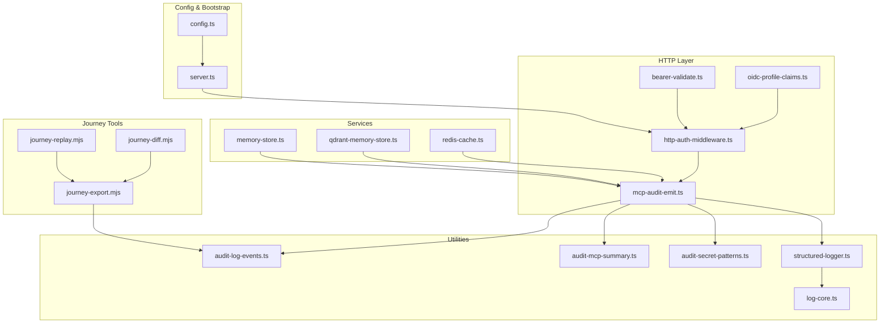
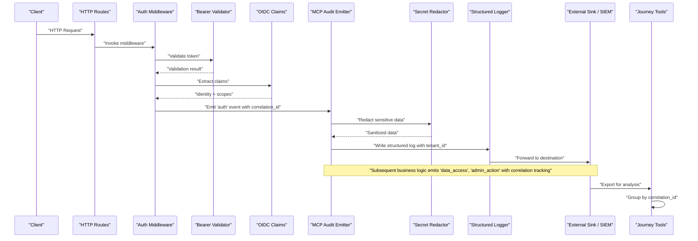
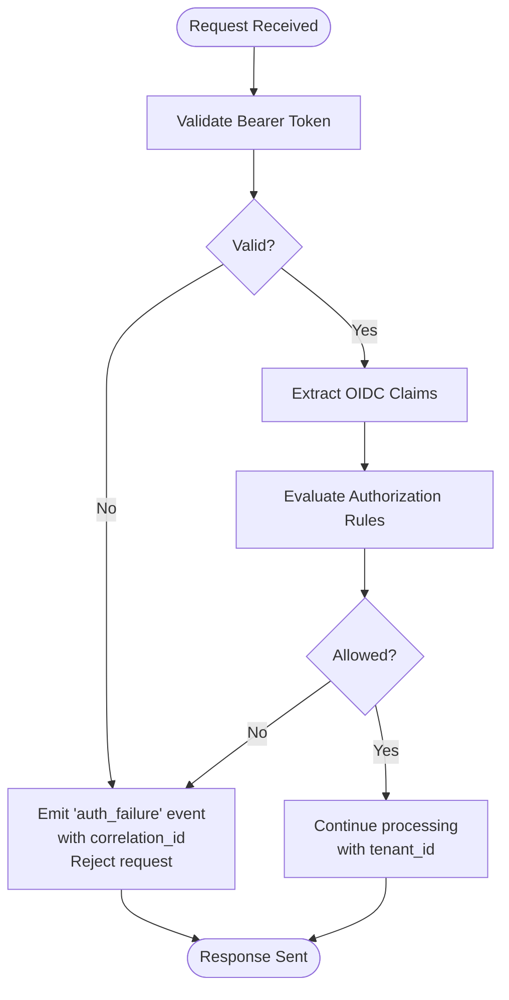
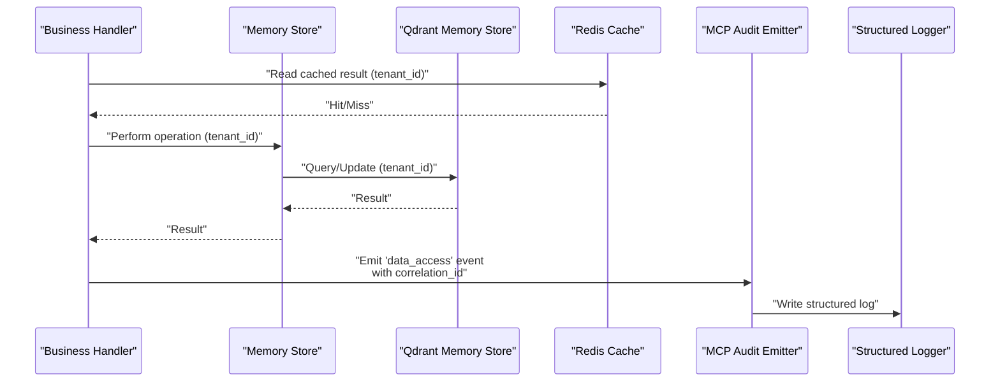
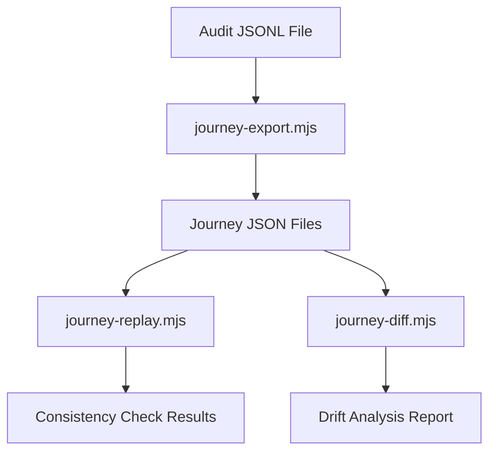
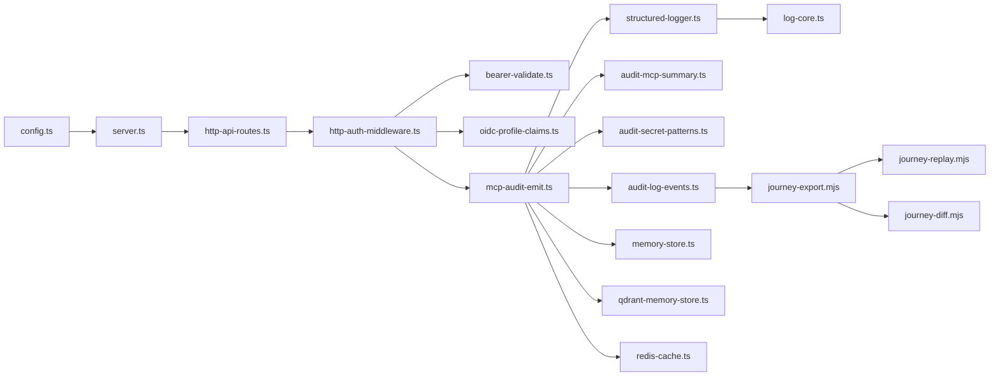

# Audit Logging and Compliance

<cite>
**Referenced Files in This Document**
- [audit-log.md](file://docs/security/audit-log.md)
- [mcp-audit-emit.ts](file://src/http/mcp-audit-emit.ts)
- [audit-log-events.ts](file://src/utils/audit-log-events.ts)
- [audit-mcp-summary.ts](file://src/utils/audit-mcp-summary.ts)
- [audit-secret-patterns.ts](file://src/utils/audit-secret-patterns.ts)
- [structured-logger.ts](file://src/utils/structured-logger.ts)
- [http-auth-middleware.ts](file://src/http/http-auth-middleware.ts)
- [oidc-profile-claims.ts](file://src/http/oidc-profile-claims.ts)
- [bearer-validate.ts](file://src/http/bearer-validate.ts)
- [log-core.ts](file://src/utils/log-core.ts)
- [global-error-handlers.ts](file://src/utils/global-error-handlers.ts)
- [http-api-routes.ts](file://src/http/http-api-routes.ts)
- [memory-store.ts](file://src/services/memory-store.ts)
- [qdrant-memory-store.ts](file://src/services/qdrant/memory-store.ts)
- [redis-cache.ts](file://src/services/redis-cache.ts)
- [config.ts](file://src/config.ts)
- [server.ts](file://src/server.ts)
- [journey-export.mjs](file://scripts/journey-export.mjs)
- [journey-replay.mjs](file://scripts/journey-replay.mjs)
- [journey-diff.mjs](file://scripts/journey-diff.mjs)
</cite>

## Update Summary
**Changes Made**
- Added comprehensive secret redaction patterns and centralized secret management
- Enhanced correlation tracking with `correlation_id` and `tenant_id` fields for forensic analysis
- Introduced configurable verbosity levels (AUDIT_LOG_LEVEL 0-3) for audit event detail control
- Added journey export tools for audit log analysis, replay, and comparison
- Updated structured logger with enhanced sanitization and security measures
- Expanded compliance reporting capabilities with journey-based analysis tools

## Table of Contents
1. [Introduction](#introduction)
2. [Project Structure](#project-structure)
3. [Core Components](#core-components)
4. [Architecture Overview](#architecture-overview)
5. [Detailed Component Analysis](#detailed-component-analysis)
6. [Dependency Analysis](#dependency-analysis)
7. [Performance Considerations](#performance-considerations)
8. [Troubleshooting Guide](#troubleshooting-guide)
9. [Conclusion](#conclusion)
10. [Appendices](#appendices)

## Introduction
This document explains the enhanced audit logging and compliance features in Kairos MCP. It covers the structured audit event system with correlation tracking, secret redaction patterns, configurable verbosity levels, and comprehensive journey analysis tools. The system provides robust authentication, authorization decisions, data access patterns, and administrative action logging with advanced forensic analysis capabilities.

## Project Structure
The enhanced audit system spans HTTP middleware, utilities, services, configuration, and specialized journey analysis tools:
- Documentation: security guidance and audit specification
- HTTP layer: middleware that enriches context and emits correlation-tracked audit events
- Utilities: event definitions, MCP summary helpers, secret redaction patterns, structured logger, and core logging
- Services: memory and cache stores used by audited operations
- Journey tools: export, replay, and diff analysis for audit logs
- Configuration and server bootstrap: wiring of logging and audit behavior with verbosity controls

**Diagram sources**
- [http-auth-middleware.ts](file://src/http/http-auth-middleware.ts)
- [bearer-validate.ts](file://src/http/bearer-validate.ts)
- [oidc-profile-claims.ts](file://src/http/oidc-profile-claims.ts)
- [mcp-audit-emit.ts](file://src/http/mcp-audit-emit.ts)
- [audit-log-events.ts](file://src/utils/audit-log-events.ts)
- [audit-mcp-summary.ts](file://src/utils/audit-mcp-summary.ts)
- [audit-secret-patterns.ts](file://src/utils/audit-secret-patterns.ts)
- [structured-logger.ts](file://src/utils/structured-logger.ts)
- [log-core.ts](file://src/utils/log-core.ts)
- [memory-store.ts](file://src/services/memory-store.ts)
- [qdrant-memory-store.ts](file://src/services/qdrant/memory-store.ts)
- [redis-cache.ts](file://src/services/redis-cache.ts)
- [journey-export.mjs](file://scripts/journey-export.mjs)
- [journey-replay.mjs](file://scripts/journey-replay.mjs)
- [journey-diff.mjs](file://scripts/journey-diff.mjs)
- [config.ts](file://src/config.ts)
- [server.ts](file://src/server.ts)

**Section sources**
- [audit-log.md](file://docs/security/audit-log.md)
- [mcp-audit-emit.ts](file://src/http/mcp-audit-emit.ts)
- [audit-log-events.ts](file://src/utils/audit-log-events.ts)
- [audit-mcp-summary.ts](file://src/utils/audit-mcp-summary.ts)
- [audit-secret-patterns.ts](file://src/utils/audit-secret-patterns.ts)
- [structured-logger.ts](file://src/utils/structured-logger.ts)
- [log-core.ts](file://src/utils/log-core.ts)
- [http-auth-middleware.ts](file://src/http/http-auth-middleware.ts)
- [bearer-validate.ts](file://src/http/bearer-validate.ts)
- [oidc-profile-claims.ts](file://src/http/oidc-profile-claims.ts)
- [memory-store.ts](file://src/services/memory-store.ts)
- [qdrant-memory-store.ts](file://src/services/qdrant/memory-store.ts)
- [redis-cache.ts](file://src/services/redis-cache.ts)
- [config.ts](file://src/config.ts)
- [server.ts](file://src/server.ts)

## Core Components
- **Enhanced Structured Logger**: Provides consistent JSON-based logging with advanced sanitization, depth limiting, and secure transport to configured sinks.
- **Centralized Secret Redaction**: Shared patterns for detecting and redacting sensitive information including Bearer tokens, API keys, and various service-specific secrets.
- **Correlation Tracking**: Advanced correlation model using `correlation_id` and `tenant_id` fields for grouping related requests and multi-step agent runs.
- **Configurable Verbosity Levels**: AUDIT_LOG_LEVEL (0-3) controls what gets captured in audit events from metadata-only to full request/response details.
- **MCP Audit Emitter**: Emits standardized audit events around MCP tool invocations with correlation tracking and secret redaction.
- **Authentication Middleware**: Enriches request context with user identity, scopes, tenant, and correlation IDs while triggering auth/authz audit events.
- **Journey Analysis Tools**: Export, replay, and diff tools for analyzing audit logs as complete user journeys.
- **Memory and Cache Stores**: Audited data access points for reads/writes and caching behaviors with correlation tracking.

Key responsibilities:
- Ensure every sensitive action produces an immutable, timestamped, structured record with correlation tracking.
- Enrich records with user, session, resource, tenant, and outcome metadata.
- Apply comprehensive secret redaction before emission.
- Support filtering, sampling, and verbosity control based on operational needs.
- Integrate with external sinks for centralized collection and long-term retention.

**Section sources**
- [structured-logger.ts](file://src/utils/structured-logger.ts)
- [audit-secret-patterns.ts](file://src/utils/audit-secret-patterns.ts)
- [audit-log-events.ts](file://src/utils/audit-log-events.ts)
- [mcp-audit-emit.ts](file://src/http/mcp-audit-emit.ts)
- [http-auth-middleware.ts](file://src/http/http-auth-middleware.ts)
- [oidc-profile-claims.ts](file://src/http/oidc-profile-claims.ts)
- [memory-store.ts](file://src/services/memory-store.ts)
- [qdrant-memory-store.ts](file://src/services/qdrant/memory-store.ts)
- [redis-cache.ts](file://src/services/redis-cache.ts)
- [config.ts](file://src/config.ts)
- [server.ts](file://src/server.ts)

## Architecture Overview
The enhanced audit architecture follows a layered approach with correlation tracking and secret protection:
- **Ingress and Auth**: Requests enter via HTTP routes; bearer validation and OIDC profile extraction establish identity and scope.
- **Context Enrichment**: Middleware attaches user, tenant, correlation ID, and request ID to the request context.
- **Audit Emission**: The MCP audit emitter writes structured events at key decision points with correlation tracking and secret redaction.
- **Logging Pipeline**: Structured logger formats and forwards logs to configured destinations with comprehensive sanitization.
- **Journey Analysis**: Export tools group correlated events into complete user journeys for replay and comparison.
- **Storage and Retention**: Logs are forwarded to external systems where retention and archival policies apply.

**Diagram sources**
- [http-api-routes.ts](file://src/http/http-api-routes.ts)
- [http-auth-middleware.ts](file://src/http/http-auth-middleware.ts)
- [bearer-validate.ts](file://src/http/bearer-validate.ts)
- [oidc-profile-claims.ts](file://src/http/oidc-profile-claims.ts)
- [mcp-audit-emit.ts](file://src/http/mcp-audit-emit.ts)
- [audit-secret-patterns.ts](file://src/utils/audit-secret-patterns.ts)
- [structured-logger.ts](file://src/utils/structured-logger.ts)
- [journey-export.mjs](file://scripts/journey-export.mjs)

## Detailed Component Analysis

### Authentication and Authorization Events with Correlation Tracking
- **Purpose**: Record login attempts, token validation outcomes, and authorization decisions tied to resources and scopes with correlation tracking.
- **Enrichment**: User ID, issuer, scopes, client IP, user agent, tenant_id, correlation_id, and decision outcome.
- **Flow**:
  - Bearer validation checks token validity and extracts principal.
  - OIDC profile claims provide stable identifiers and attributes.
  - Middleware emits auth/authz events with contextual metadata and correlation tracking.

**Diagram sources**
- [bearer-validate.ts](file://src/http/bearer-validate.ts)
- [oidc-profile-claims.ts](file://src/http/oidc-profile-claims.ts)
- [http-auth-middleware.ts](file://src/http/http-auth-middleware.ts)
- [mcp-audit-emit.ts](file://src/http/mcp-audit-emit.ts)

**Section sources**
- [bearer-validate.ts](file://src/http/bearer-validate.ts)
- [oidc-profile-claims.ts](file://src/http/oidc-profile-claims.ts)
- [http-auth-middleware.ts](file://src/http/http-auth-middleware.ts)
- [mcp-audit-emit.ts](file://src/http/mcp-audit-emit.ts)

### Data Access Patterns with Tenant Isolation
- **Purpose**: Capture read/write operations on memory and vector stores with tenant isolation, including query parameters, affected resources, and outcomes.
- **Enrichment**: Resource identifiers, operation type, space/context, tenant_id, correlation_id, result size, latency, and error codes when applicable.
- **Integration Points**:
  - Memory store wrappers emit events around CRUD operations with tenant context.
  - Qdrant-backed memory store emits events for vector operations with correlation tracking.
  - Redis cache emits events for cache hits/misses and invalidations with tenant isolation.

**Diagram sources**
- [memory-store.ts](file://src/services/memory-store.ts)
- [qdrant-memory-store.ts](file://src/services/qdrant/memory-store.ts)
- [redis-cache.ts](file://src/services/redis-cache.ts)
- [mcp-audit-emit.ts](file://src/http/mcp-audit-emit.ts)
- [structured-logger.ts](file://src/utils/structured-logger.ts)

**Section sources**
- [memory-store.ts](file://src/services/memory-store.ts)
- [qdrant-memory-store.ts](file://src/services/qdrant/memory-store.ts)
- [redis-cache.ts](file://src/services/redis-cache.ts)
- [mcp-audit-emit.ts](file://src/http/mcp-audit-emit.ts)

### Administrative Actions with Enhanced Security
- **Purpose**: Track privileged operations such as configuration changes, user management, and system maintenance tasks with enhanced security.
- **Enrichment**: Admin identity, target entity, change details (sanitized), approval references, correlation_id, and outcome.
- **Security**: All administrative actions include correlation tracking and comprehensive secret redaction.

**Section sources**
- [mcp-audit-emit.ts](file://src/http/mcp-audit-emit.ts)
- [audit-log-events.ts](file://src/utils/audit-log-events.ts)

### MCP Tool Invocation Summary with Secret Protection
- **Purpose**: Summarize MCP tool calls for audit trails with comprehensive secret protection, capturing sanitized inputs, outputs, duration, and status.
- **Enrichment**: Tool name, version, caller identity, correlation_id, tenant_id, and failure reasons.
- **Secret Protection**: Centralized secret redaction patterns protect against sensitive data leakage.

**Section sources**
- [audit-mcp-summary.ts](file://src/utils/audit-mcp-summary.ts)
- [audit-secret-patterns.ts](file://src/utils/audit-secret-patterns.ts)
- [mcp-audit-emit.ts](file://src/http/mcp-audit-emit.ts)

### Enhanced Structured Logger and Log Core
- **Purpose**: Provide a consistent, schema-driven logging interface with advanced sanitization and transport mechanism.
- **Responsibilities**:
  - Format events as structured JSON with comprehensive sanitization.
  - Apply filters, redactions, and verbosity controls before emission.
  - Forward to configured sinks (stdout, files, network endpoints) with security protections.
  - Implement depth limiting, key limiting, and string length capping.

**Section sources**
- [structured-logger.ts](file://src/utils/structured-logger.ts)
- [log-core.ts](file://src/utils/log-core.ts)

### Global Error Handling and Audit Resilience
- **Purpose**: Ensure errors during audit emission do not disrupt primary operations while still recording failures.
- **Behavior**:
  - Catch and log audit emission errors without propagating to callers.
  - Include minimal diagnostic metadata for troubleshooting.
  - Maintain audit stream resilience even when write operations fail.

**Section sources**
- [global-error-handlers.ts](file://src/utils/global-error-handlers.ts)

### Journey Analysis Tools
- **Purpose**: Comprehensive tools for exporting, replaying, and comparing audit logs as complete user journeys.
- **Features**:
  - **Export**: Group audit events by correlation_id into journey JSON files with optional tenant redaction.
  - **Replay**: Replay exported journeys against running servers with consistency checking.
  - **Diff**: Compare journey sets across versions to detect drift in tool sequences, response shapes, error rates, and timing.

**Diagram sources**
- [journey-export.mjs](file://scripts/journey-export.mjs)
- [journey-replay.mjs](file://scripts/journey-replay.mjs)
- [journey-diff.mjs](file://scripts/journey-diff.mjs)

**Section sources**
- [journey-export.mjs](file://scripts/journey-export.mjs)
- [journey-replay.mjs](file://scripts/journey-replay.mjs)
- [journey-diff.mjs](file://scripts/journey-diff.mjs)

## Dependency Analysis
The enhanced audit subsystem depends on:
- HTTP routing and middleware for request context and lifecycle hooks.
- OIDC and bearer validation for identity and scope resolution.
- Centralized secret redaction for security.
- Services for data access auditing with tenant isolation.
- Journey tools for analysis and compliance reporting.
- Configuration and server bootstrap for initialization and sink wiring.

**Diagram sources**
- [config.ts](file://src/config.ts)
- [server.ts](file://src/server.ts)
- [http-api-routes.ts](file://src/http/http-api-routes.ts)
- [http-auth-middleware.ts](file://src/http/http-auth-middleware.ts)
- [bearer-validate.ts](file://src/http/bearer-validate.ts)
- [oidc-profile-claims.ts](file://src/http/oidc-profile-claims.ts)
- [mcp-audit-emit.ts](file://src/http/mcp-audit-emit.ts)
- [audit-log-events.ts](file://src/utils/audit-log-events.ts)
- [audit-mcp-summary.ts](file://src/utils/audit-mcp-summary.ts)
- [audit-secret-patterns.ts](file://src/utils/audit-secret-patterns.ts)
- [structured-logger.ts](file://src/utils/structured-logger.ts)
- [log-core.ts](file://src/utils/log-core.ts)
- [memory-store.ts](file://src/services/memory-store.ts)
- [qdrant-memory-store.ts](file://src/services/qdrant/memory-store.ts)
- [redis-cache.ts](file://src/services/redis-cache.ts)
- [journey-export.mjs](file://scripts/journey-export.mjs)
- [journey-replay.mjs](file://scripts/journey-replay.mjs)
- [journey-diff.mjs](file://scripts/journey-diff.mjs)

**Section sources**
- [config.ts](file://src/config.ts)
- [server.ts](file://src/server.ts)
- [http-api-routes.ts](file://src/http/http-api-routes.ts)
- [http-auth-middleware.ts](file://src/http/http-auth-middleware.ts)
- [bearer-validate.ts](file://src/http/bearer-validate.ts)
- [oidc-profile-claims.ts](file://src/http/oidc-profile-claims.ts)
- [mcp-audit-emit.ts](file://src/http/mcp-audit-emit.ts)
- [audit-log-events.ts](file://src/utils/audit-log-events.ts)
- [audit-mcp-summary.ts](file://src/utils/audit-mcp-summary.ts)
- [audit-secret-patterns.ts](file://src/utils/audit-secret-patterns.ts)
- [structured-logger.ts](file://src/utils/structured-logger.ts)
- [log-core.ts](file://src/utils/log-core.ts)
- [memory-store.ts](file://src/services/memory-store.ts)
- [qdrant-memory-store.ts](file://src/services/qdrant/memory-store.ts)
- [redis-cache.ts](file://src/services/redis-cache.ts)
- [journey-export.mjs](file://scripts/journey-export.mjs)
- [journey-replay.mjs](file://scripts/journey-replay.mjs)
- [journey-diff.mjs](file://scripts/journey-diff.mjs)

## Performance Considerations
- **Asynchronous Emission**: Emit audit events asynchronously to minimize request latency.
- **Verbosity Control**: Use AUDIT_LOG_LEVEL to balance detail vs performance (0=off, 1=metadata only, 2=request args, 3=full response).
- **Sampling and Filtering**: Configure sampling rates for high-volume events and filter out noisy or non-sensitive operations.
- **Secret Redaction at Source**: Sanitize inputs/outputs early using centralized patterns to reduce payload size and protect sensitive data.
- **Depth and Size Limits**: Implement bounds on object depth, key count, and string length to prevent excessive memory usage.
- **Batched Writes**: Where supported, batch log entries to external sinks to reduce overhead.
- **Backpressure Handling**: Implement queueing and backpressure controls to prevent log storms from impacting service stability.
- **Journey Analysis Efficiency**: Journey tools process audit logs efficiently with streaming and filtering capabilities.

## Troubleshooting Guide
Common issues and resolutions:
- **Missing Identity Metadata**: Verify OIDC claims extraction and bearer validation paths; ensure correlation IDs propagate through middleware.
- **Audit Events Not Appearing**: Check structured logger configuration and sink connectivity; inspect global error handlers for silent failures.
- **Excessive Log Volume**: Adjust AUDIT_LOG_LEVEL verbosity, filtering rules, and sampling thresholds; refine event categories to focus on high-value signals.
- **Sensitive Data Leakage**: Review centralized secret redaction patterns; enforce field-level redaction policies across all audit emitters.
- **Correlation Issues**: Verify correlation_id generation and propagation through request lifecycle; check journey export grouping.
- **Tenant Context Problems**: Ensure tenant_id is properly extracted and propagated through middleware and audit events.

Operational checks:
- Confirm destinations are reachable and authenticated.
- Validate retention policies align with compliance requirements.
- Monitor metrics around audit emission success/failure rates.
- Test journey export/replay functionality regularly.
- Verify secret redaction effectiveness with test data containing known secrets.

**Section sources**
- [global-error-handlers.ts](file://src/utils/global-error-handlers.ts)
- [structured-logger.ts](file://src/utils/structured-logger.ts)
- [log-core.ts](file://src/utils/log-core.ts)
- [audit-mcp-summary.ts](file://src/utils/audit-mcp-summary.ts)
- [audit-secret-patterns.ts](file://src/utils/audit-secret-patterns.ts)
- [mcp-audit-emit.ts](file://src/http/mcp-audit-emit.ts)
- [journey-export.mjs](file://scripts/journey-export.mjs)

## Conclusion
Kairos MCP implements a comprehensive enhanced audit logging and compliance framework centered on structured events emitted across authentication, authorization, data access, and administrative operations. With correlation tracking via correlation_id and tenant_id fields, centralized secret redaction patterns, configurable verbosity levels, and advanced journey analysis tools, the system supports sophisticated forensic analysis, compliance reporting, and operational observability while maintaining performance and privacy.

## Appendices

### Enhanced Audit Log Format and Event Categorization
- **Event Categories**:
  - Authentication: login attempts, token validation, session lifecycle with correlation tracking.
  - Authorization: access decisions per resource and scope with tenant isolation.
  - Data Access: reads/writes to memory and vector stores with tenant context, cache interactions.
  - Administrative Actions: privileged operations and configuration changes with enhanced security.
- **Common Fields**:
  - Timestamp, event type, correlation_id, tenant_id, user identity, resource identifiers, outcome, latency, error codes.
- **Enrichment Strategy**:
  - Stable identifiers from OIDC claims with correlation tracking.
  - Request-scoped metadata propagated via middleware with tenant context.
  - Sanitized payloads excluding sensitive content using centralized secret patterns.

**Section sources**
- [audit-log-events.ts](file://src/utils/audit-log-events.ts)
- [oidc-profile-claims.ts](file://src/http/oidc-profile-claims.ts)
- [http-auth-middleware.ts](file://src/http/http-auth-middleware.ts)
- [audit-mcp-summary.ts](file://src/utils/audit-mcp-summary.ts)
- [audit-secret-patterns.ts](file://src/utils/audit-secret-patterns.ts)

### Configurable Verbosity Levels
- **Level 0 (Off)**: No MCP audit events emitted.
- **Level 1 (Metadata)**: Tool name, correlation_id, tenant_id, request_id, timestamps, duration_ms, status, error_code.
- **Level 2 (Request)**: Level 1 + request arguments (sanitized, bounded).
- **Level 3 (Full)**: Level 2 + response body (sanitized, bounded).

**Section sources**
- [config.ts](file://src/config.ts)
- [mcp-audit-emit.ts](file://src/http/mcp-audit-emit.ts)

### Journey Analysis and Compliance Reporting
- **Export Capabilities**: Group audit events by correlation_id into journey JSON files with optional tenant redaction for sharing.
- **Replay Testing**: Replay exported journeys against running servers with consistency checking and drift detection.
- **Diff Analysis**: Compare journey sets across versions to detect tool sequence drift, response shape changes, error rate deltas, and timing anomalies.
- **Report Generation**: Aggregate structured events to produce compliance reports aligned with internal policies and external frameworks.
- **Evidence Collection**: Export filtered event sets for audits, including timestamps, identities, correlation tracking, and outcomes.

**Section sources**
- [audit-log.md](file://docs/security/audit-log.md)
- [journey-export.mjs](file://scripts/journey-export.mjs)
- [journey-replay.mjs](file://scripts/journey-replay.mjs)
- [journey-diff.mjs](file://scripts/journey-diff.mjs)
- [mcp-audit-emit.ts](file://src/http/mcp-audit-emit.ts)

### Enhanced Secret Redaction and Privacy Protection
- **Centralized Patterns**: Shared secret detection patterns for Bearer tokens, API keys, GitHub tokens, Slack tokens, Google API keys, and other service-specific secrets.
- **Comprehensive Coverage**: Apply secret redaction at multiple layers - request summarization, response summarization, and journey export.
- **Tenant Isolation**: Optional tenant_id redaction in journey exports for sharing externally.
- **Anonymization Techniques**: Hash or pseudonymize user identifiers where appropriate; mask or truncate sensitive fields before emission.
- **Regulatory Alignment**: Align practices with GDPR principles (data minimization, purpose limitation) and SOC 2 controls (security, availability, confidentiality).

**Section sources**
- [audit-secret-patterns.ts](file://src/utils/audit-secret-patterns.ts)
- [audit-mcp-summary.ts](file://src/utils/audit-mcp-summary.ts)
- [journey-export.mjs](file://scripts/journey-export.mjs)
- [audit-log-events.ts](file://src/utils/audit-log-events.ts)
- [audit-log.md](file://docs/security/audit-log.md)

### Log Retention Policies and Secure Storage
- **Retention**: Define time-based and lifecycle policies for short-term and long-term storage with correlation tracking support.
- **Secure Storage**: Encrypt logs at rest and in transit; restrict access via IAM and least privilege with tenant isolation.
- **Immutability**: Prevent tampering by using append-only storage and integrity checks with correlation chain validation.
- **Journey Integrity**: Ensure correlation chains remain intact across journey export, replay, and diff operations.

**Section sources**
- [structured-logger.ts](file://src/utils/structured-logger.ts)
- [log-core.ts](file://src/utils/log-core.ts)

### Configuration Examples and Alerting
- **Destinations**: Configure stdout, file, and network sinks via environment variables or config files with AUDIT_LOG_FILE and AUDIT_LOG_LEVEL.
- **Filtering Rules**: Enable/disable event categories; set verbosity levels per category; configure sampling rates.
- **Alerting Thresholds**: Define thresholds for failed auth attempts, unauthorized access spikes, anomalous data access patterns, and journey drift detection.
- **Journey Analysis**: Configure minimum tool counts, timing thresholds, and strict modes for automated compliance checking.

**Section sources**
- [config.ts](file://src/config.ts)
- [server.ts](file://src/server.ts)
- [structured-logger.ts](file://src/utils/structured-logger.ts)
- [journey-diff.mjs](file://scripts/journey-diff.mjs)

### SIEM Integration and Aggregation Pipelines
- **Integration Points**: Forward structured logs to SIEM collectors (e.g., syslog, HTTP endpoints) with correlation tracking support.
- **Standard Formats**: Use standard formats compatible with common SIEM parsers including correlation_id and tenant_id fields.
- **Aggregation**: Normalize fields for correlation across systems; deduplicate and enrich with threat intelligence feeds as needed.
- **Journey Correlation**: Leverage correlation_id for grouping related events across different systems and time periods.

**Section sources**
- [structured-logger.ts](file://src/utils/structured-logger.ts)
- [log-core.ts](file://src/utils/log-core.ts)
- [mcp-audit-emit.ts](file://src/http/mcp-audit-emit.ts)