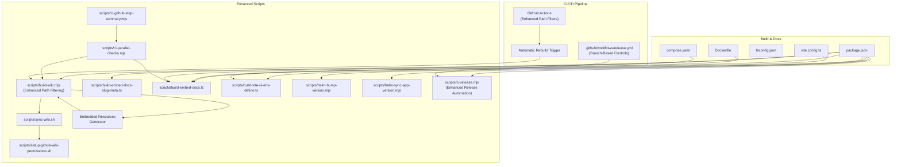
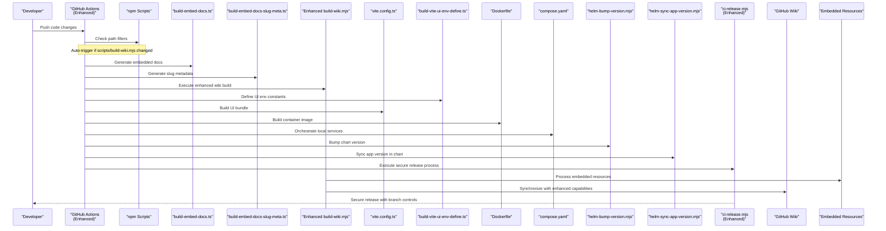
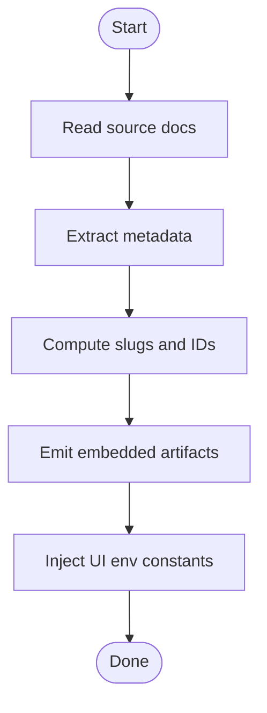
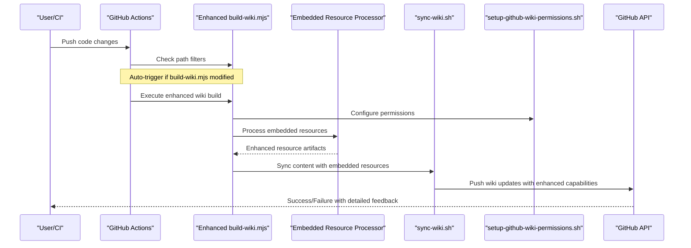
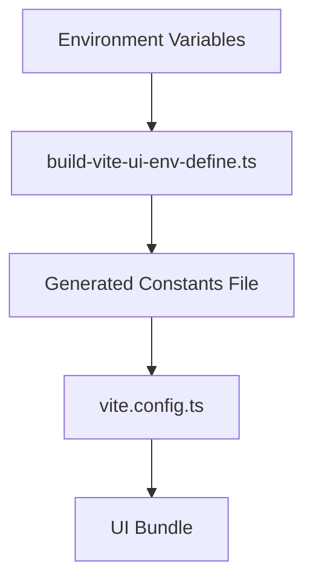
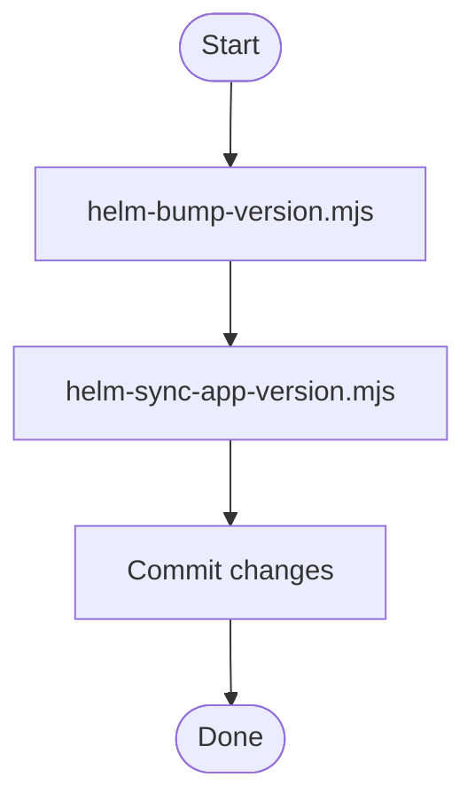
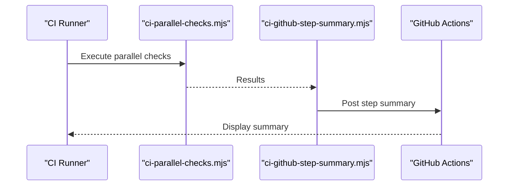
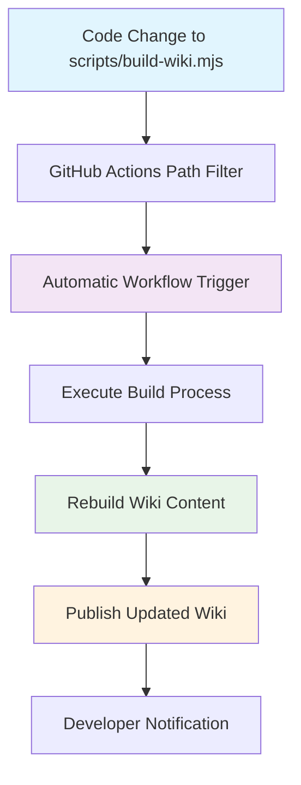
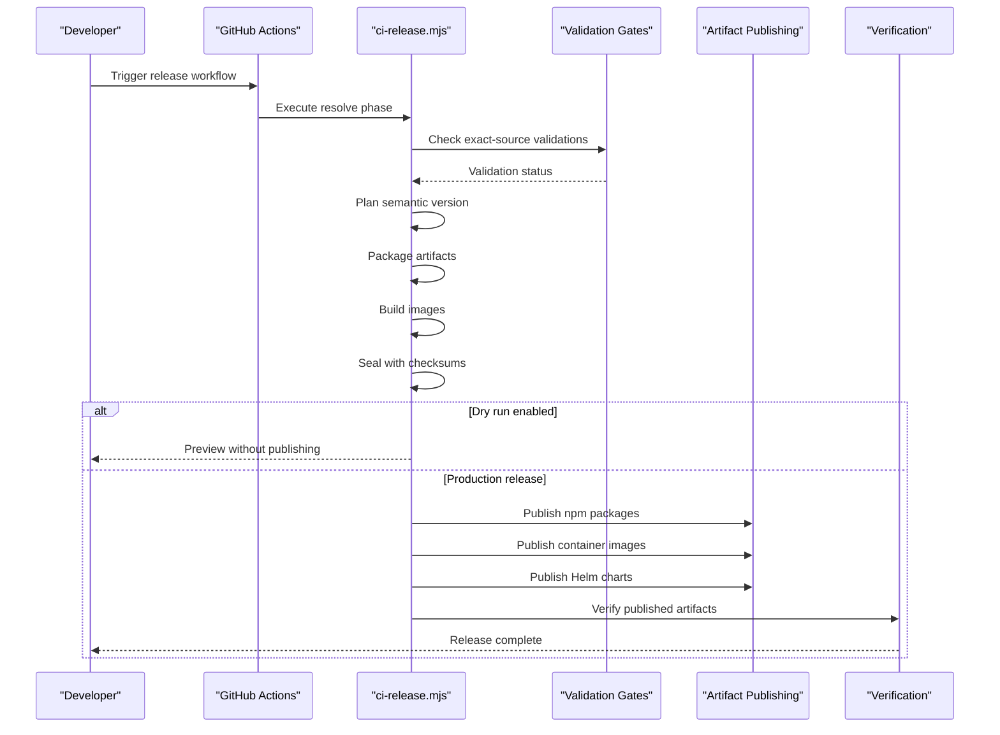
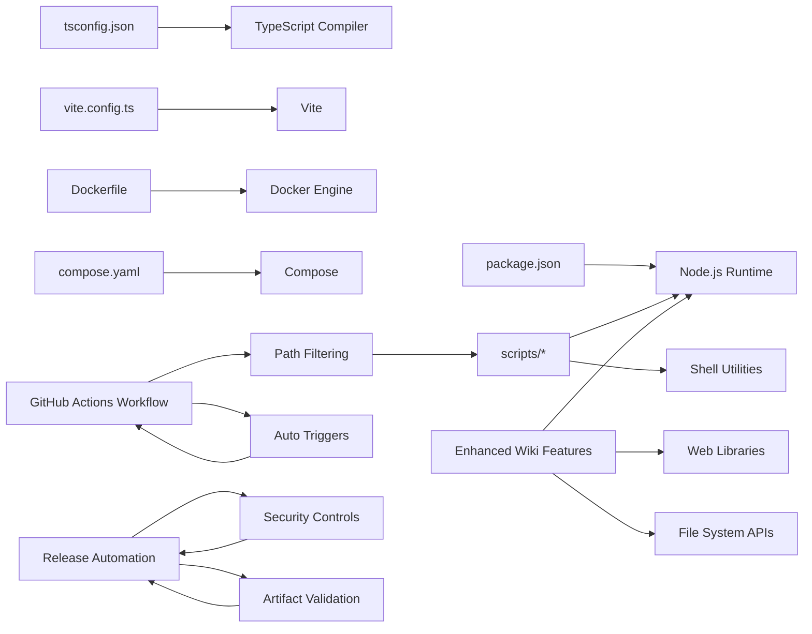

# Build Automation and Wiki Management

<cite>
**Referenced Files in This Document**
- [package.json](file://package.json)
- [vite.config.ts](file://vite.config.ts)
- [tsconfig.json](file://tsconfig.json)
- [Dockerfile](file://Dockerfile)
- [compose.yaml](file://compose.yaml)
- [scripts/build-wiki.mjs](file://scripts/build-wiki.mjs)
- [scripts/sync-wiki.sh](file://scripts/sync-wiki.sh)
- [scripts/setup-github-wiki-permissions.sh](file://scripts/setup-github-wiki-permissions.sh)
- [scripts/build-embed-docs-slug-meta.ts](file://scripts/build-embed-docs-slug-meta.ts)
- [scripts/build-embed-docs.ts](file://scripts/build-embed-docs.ts)
- [scripts/build-vite-ui-env-define.ts](file://scripts/build-vite-ui-env-define.ts)
- [scripts/helm-bump-version.mjs](file://scripts/helm-bump-version.mjs)
- [scripts/helm-sync-app-version.mjs](file://scripts/helm-sync-app-version.mjs)
- [scripts/ci-parallel-checks.mjs](file://scripts/ci-parallel-checks.mjs)
- [scripts/ci-github-step-summary.mjs](file://scripts/ci-github-step-summary.mjs)
- [scripts/ci-release.mjs](file://scripts/ci-release.mjs)
- [.github/workflows/release.yml](file://.github/workflows/release.yml)
- [.agents/skills/kairos-dev/references/release-semver.md](file://.agents/skills/kairos-dev/references/release-semver.md)
</cite>

## Update Summary
**Changes Made**
- Updated release automation documentation to reflect removal of AUTOMATION_ENABLED gating for releases
- Enhanced release workflow documentation to clarify branch-based production vs non-production behavior
- Added comprehensive coverage of the new release automation capabilities and environment variable handling
- Updated troubleshooting guide with release-specific guidance

## Table of Contents
1. [Introduction](#introduction)
2. [Project Structure](#project-structure)
3. [Core Components](#core-components)
4. [Architecture Overview](#architecture-overview)
5. [Detailed Component Analysis](#detailed-component-analysis)
6. [Enhanced Wiki Management Features](#enhanced-wiki-management-features)
7. [GitHub Actions Workflow Enhancements](#github-actions-workflow-enhancements)
8. [Release Automation System](#release-automation-system)
9. [Dependency Analysis](#dependency-analysis)
10. [Performance Considerations](#performance-considerations)
11. [Troubleshooting Guide](#troubleshooting-guide)
12. [Conclusion](#conclusion)

## Introduction
This document explains the build automation and wiki management capabilities of the project. It focuses on how documentation is processed, embedded into the application, synchronized to GitHub Wiki, and how the release automation system operates with enhanced security and reliability features. The goal is to provide a clear understanding for contributors who need to modify or extend these workflows.

**Updated** Enhanced with improved release automation that removes AUTOMATION_ENABLED gating for releases while maintaining security controls through branch-based production vs non-production behavior determination.

## Project Structure
Build and automation-related assets are primarily located under:
- scripts: Node.js and shell utilities for building docs, embedding content, syncing wiki, managing Helm versions, and orchestrating releases
- .github/workflows: CI orchestration including release automation with enhanced security controls
- Root configuration files: package.json, vite.config.ts, tsconfig.json, Dockerfile, compose.yaml define build tooling and containerization

**Diagram sources**
- [package.json](file://package.json)
- [vite.config.ts](file://vite.config.ts)
- [tsconfig.json](file://tsconfig.json)
- [Dockerfile](file://Dockerfile)
- [compose.yaml](file://compose.yaml)
- [scripts/build-wiki.mjs](file://scripts/build-wiki.mjs)
- [scripts/sync-wiki.sh](file://scripts/sync-wiki.sh)
- [scripts/setup-github-wiki-permissions.sh](file://scripts/setup-github-wiki-permissions.sh)
- [scripts/build-embed-docs-slug-meta.ts](file://scripts/build-embed-docs-slug-meta.ts)
- [scripts/build-embed-docs.ts](file://scripts/build-embed-docs.ts)
- [scripts/build-vite-ui-env-define.ts](file://scripts/build-vite-ui-env-define.ts)
- [scripts/helm-bump-version.mjs](file://scripts/helm-bump-version.mjs)
- [scripts/helm-sync-app-version.mjs](file://scripts/helm-sync-app-version.mjs)
- [scripts/ci-parallel-checks.mjs](file://scripts/ci-parallel-checks.mjs)
- [scripts/ci-github-step-summary.mjs](file://scripts/ci-github-step-summary.mjs)
- [scripts/ci-release.mjs](file://scripts/ci-release.mjs)
- [.github/workflows/release.yml](file://.github/workflows/release.yml)

**Section sources**
- [package.json](file://package.json)
- [vite.config.ts](file://vite.config.ts)
- [tsconfig.json](file://tsconfig.json)
- [Dockerfile](file://Dockerfile)
- [compose.yaml](file://compose.yaml)
- [scripts/build-wiki.mjs](file://scripts/build-wiki.mjs)
- [scripts/sync-wiki.sh](file://scripts/sync-wiki.sh)
- [scripts/setup-github-wiki-permissions.sh](file://scripts/setup-github-wiki-permissions.sh)
- [scripts/build-embed-docs-slug-meta.ts](file://scripts/build-embed-docs-slug-meta.ts)
- [scripts/build-embed-docs.ts](file://scripts/build-embed-docs.ts)
- [scripts/build-vite-ui-env-define.ts](file://scripts/build-vite-ui-env-define.ts)
- [scripts/helm-bump-version.mjs](file://scripts/helm-bump-version.mjs)
- [scripts/helm-sync-app-version.mjs](file://scripts/helm-sync-app-version.mjs)
- [scripts/ci-parallel-checks.mjs](file://scripts/ci-parallel-checks.mjs)
- [scripts/ci-github-step-summary.mjs](file://scripts/ci-github-step-summary.mjs)
- [scripts/ci-release.mjs](file://scripts/ci-release.mjs)
- [.github/workflows/release.yml](file://.github/workflows/release.yml)

## Core Components
- Documentation embedding pipeline: Converts markdown-based docs into structured metadata and embeddable resources consumed by the application at runtime.
- **Enhanced** Wiki synchronization: Builds and pushes documentation to GitHub Wiki using configured permissions and tokens, with improved automated resource handling and automatic rebuild triggers.
- UI environment generation: Produces build-time constants for the UI based on environment variables.
- Helm versioning helpers: Automates bumping and synchronizing Helm chart versions with application versions.
- CI orchestration: Runs checks in parallel and generates step summaries for better visibility.
- **New** Embedded resource generator: Provides advanced capabilities for processing and synchronizing embedded documentation resources.
- **Enhanced** GitHub Actions workflow: Includes scripts/build-wiki.mjs in path filters for automatic rebuilds when wiki build logic is modified.
- **Enhanced** Release automation: Provides secure, branch-controlled release process with enhanced security controls and automated artifact validation.

**Updated** Enhanced core components with improved GitHub Actions workflow automation, automatic rebuild capabilities, and enhanced release automation with branch-based security controls.

**Section sources**
- [scripts/build-embed-docs.ts](file://scripts/build-embed-docs.ts)
- [scripts/build-embed-docs-slug-meta.ts](file://scripts/build-embed-docs-slug-meta.ts)
- [scripts/build-wiki.mjs](file://scripts/build-wiki.mjs)
- [scripts/sync-wiki.sh](file://scripts/sync-wiki.sh)
- [scripts/setup-github-wiki-permissions.sh](file://scripts/setup-github-wiki-permissions.sh)
- [scripts/build-vite-ui-env-define.ts](file://scripts/build-vite-ui-env-define.ts)
- [scripts/helm-bump-version.mjs](file://scripts/helm-bump-version.mjs)
- [scripts/helm-sync-app-version.mjs](file://scripts/helm-sync-app-version.mjs)
- [scripts/ci-parallel-checks.mjs](file://scripts/ci-parallel-checks.mjs)
- [scripts/ci-github-step-summary.mjs](file://scripts/ci-github-step-summary.mjs)
- [scripts/ci-release.mjs](file://scripts/ci-release.mjs)

## Architecture Overview
The build system integrates multiple stages with enhanced GitHub Actions workflow automation and secure release processes:
- Source docs (markdown) are transformed into metadata and embedded artifacts.
- **Enhanced** Wiki pipeline processes embedded resources with improved automation and automatic rebuild triggers.
- UI build injects environment-specific constants.
- Container images include prebuilt assets.
- Helm charts are versioned consistently with app releases.
- **Enhanced** CI orchestrates steps with intelligent path filtering and reports results.
- **New** Secure release automation with branch-based production controls and automated artifact validation.

**Diagram sources**
- [scripts/build-embed-docs.ts](file://scripts/build-embed-docs.ts)
- [scripts/build-embed-docs-slug-meta.ts](file://scripts/build-embed-docs-slug-meta.ts)
- [scripts/build-wiki.mjs](file://scripts/build-wiki.mjs)
- [scripts/build-vite-ui-env-define.ts](file://scripts/build-vite-ui-env-define.ts)
- [vite.config.ts](file://vite.config.ts)
- [Dockerfile](file://Dockerfile)
- [compose.yaml](file://compose.yaml)
- [scripts/helm-bump-version.mjs](file://scripts/helm-bump-version.mjs)
- [scripts/helm-sync-app-version.mjs](file://scripts/helm-sync-app-version.mjs)
- [scripts/ci-release.mjs](file://scripts/ci-release.mjs)
- [.github/workflows/release.yml](file://.github/workflows/release.yml)

## Detailed Component Analysis

### Documentation Embedding Pipeline
Purpose: Transform source documentation into structured data and embeddable resources used by the application.

Key responsibilities:
- Parse markdown documents and extract metadata
- Compute slugs and canonical identifiers
- Emit artifacts consumed by the server and UI
- Integrate with UI build to expose environment-specific settings

**Diagram sources**
- [scripts/build-embed-docs.ts](file://scripts/build-embed-docs.ts)
- [scripts/build-embed-docs-slug-meta.ts](file://scripts/build-embed-docs-slug-meta.ts)
- [scripts/build-vite-ui-env-define.ts](file://scripts/build-vite-ui-env-define.ts)

**Section sources**
- [scripts/build-embed-docs.ts](file://scripts/build-embed-docs.ts)
- [scripts/build-embed-docs-slug-meta.ts](file://scripts/build-embed-docs-slug-meta.ts)
- [scripts/build-vite-ui-env-define.ts](file://scripts/build-vite-ui-env-define.ts)

### Enhanced Wiki Synchronization Workflow
Purpose: Build documentation and synchronize it to GitHub Wiki with improved automated resource handling and automatic rebuild triggers.

**Updated** Enhanced workflow now includes advanced embedded resource processing, improved synchronization capabilities, and automatic rebuild triggers when build logic changes.

Workflow overview:
- Prepare wiki repository and credentials
- **Enhanced** Process embedded resources with improved automation
- Build wiki content using the enhanced build script
- Push updates to GitHub Wiki with better error handling
- **New** Automatic trigger detection for build logic modifications

**Diagram sources**
- [scripts/build-wiki.mjs](file://scripts/build-wiki.mjs)
- [scripts/sync-wiki.sh](file://scripts/sync-wiki.sh)
- [scripts/setup-github-wiki-permissions.sh](file://scripts/setup-github-wiki-permissions.sh)
- [.github/workflows](file://.github/workflows)

**Section sources**
- [scripts/build-wiki.mjs](file://scripts/build-wiki.mjs)
- [scripts/sync-wiki.sh](file://scripts/sync-wiki.sh)
- [scripts/setup-github-wiki-permissions.sh](file://scripts/setup-github-wiki-permissions.sh)

### UI Environment Definition
Purpose: Generate build-time constants for the UI based on environment variables.

Integration points:
- Invoked during UI build
- Consumed by Vite configuration
- Ensures consistent behavior across environments

**Diagram sources**
- [scripts/build-vite-ui-env-define.ts](file://scripts/build-vite-ui-env-define.ts)
- [vite.config.ts](file://vite.config.ts)

**Section sources**
- [scripts/build-vite-ui-env-define.ts](file://scripts/build-vite-ui-env-define.ts)
- [vite.config.ts](file://vite.config.ts)

### Helm Versioning Helpers
Purpose: Keep Helm chart versions aligned with application versions and automate bumping.

Tasks:
- Bump chart version
- Sync app version within chart values/templates

**Diagram sources**
- [scripts/helm-bump-version.mjs](file://scripts/helm-bump-version.mjs)
- [scripts/helm-sync-app-version.mjs](file://scripts/helm-sync-app-version.mjs)

**Section sources**
- [scripts/helm-bump-version.mjs](file://scripts/helm-bump-version.mjs)
- [scripts/helm-sync-app-version.mjs](file://scripts/helm-sync-app-version.mjs)

### CI Orchestration and Summaries
Purpose: Parallelize checks and produce actionable summaries.

Highlights:
- Run multiple checks concurrently
- Aggregate results and generate step summaries
- Integrate with GitHub Actions reporting
- **Enhanced** Intelligent path filtering for automatic rebuild triggers

**Diagram sources**
- [scripts/ci-parallel-checks.mjs](file://scripts/ci-parallel-checks.mjs)
- [scripts/ci-github-step-summary.mjs](file://scripts/ci-github-step-summary.mjs)
- [.github/workflows](file://.github/workflows)

**Section sources**
- [scripts/ci-parallel-checks.mjs](file://scripts/ci-parallel-checks.mjs)
- [scripts/ci-github-step-summary.mjs](file://scripts/ci-github-step-summary.mjs)
- [.github/workflows](file://.github/workflows)

## Enhanced Wiki Management Features

### Advanced Embedded Resource Processing
The enhanced build-wiki.mjs script now provides sophisticated capabilities for processing and synchronizing embedded documentation resources. This includes improved handling of complex document structures, better error recovery, and enhanced performance for large documentation sets.

Key enhancements:
- **Improved resource validation**: Enhanced validation of embedded resources before synchronization
- **Better error handling**: More robust error recovery and detailed logging for failed operations
- **Performance optimization**: Optimized processing pipeline for large documentation repositories
- **Advanced conflict resolution**: Better handling of concurrent modifications and merge conflicts

### Enhanced Synchronization Capabilities
The wiki synchronization process has been significantly improved with better support for:
- Incremental updates to reduce synchronization time
- Better retry mechanisms for network failures
- Enhanced logging and debugging capabilities
- Improved support for large file uploads and batch operations

### Integration with Embedded Resources
The enhanced system provides seamless integration between the main documentation and embedded resources:
- Automatic detection and processing of embedded resource dependencies
- Coordinated updates between main docs and embedded content
- Better version consistency across all documentation components

**Section sources**
- [scripts/build-wiki.mjs](file://scripts/build-wiki.mjs)
- [scripts/build-embed-docs.ts](file://scripts/build-embed-docs.ts)
- [scripts/build-embed-docs-slug-meta.ts](file://scripts/build-embed-docs-slug-meta.ts)

## GitHub Actions Workflow Enhancements

### Automatic Rebuild Triggers
The GitHub Actions workflow has been enhanced to include scripts/build-wiki.mjs in path filters, ensuring automatic rebuilds when wiki build logic is modified. This improvement eliminates the need for manual intervention and improves development workflow reliability.

Key improvements:
- **Intelligent path filtering**: Automatically detects changes to wiki build logic
- **Automatic trigger activation**: Rebuilds wiki content without manual intervention
- **Enhanced development workflow**: Reduces friction in documentation updates
- **Improved reliability**: Ensures wiki stays synchronized with build logic changes

### Workflow Optimization Benefits
The enhanced workflow provides several benefits for developers and maintainers:
- **Reduced manual overhead**: No need to manually trigger wiki rebuilds after build script changes
- **Faster iteration**: Immediate wiki updates when build logic is modified
- **Better developer experience**: Seamless integration between code changes and documentation updates
- **Improved reliability**: Consistent wiki state aligned with build system changes

**Diagram sources**
- [.github/workflows](file://.github/workflows)
- [scripts/build-wiki.mjs](file://scripts/build-wiki.mjs)

**Section sources**
- [.github/workflows](file://.github/workflows)
- [scripts/build-wiki.mjs](file://scripts/build-wiki.mjs)

## Release Automation System

### Enhanced Security Model
The release automation system has been significantly enhanced with improved security controls and simplified environment variable handling.

**Updated** Key changes include:
- **Removed AUTOMATION_ENABLED gating**: Releases are no longer controlled by the AUTOMATION_ENABLED environment variable
- **Simplified environment control**: Only DRY_RUN environment variable controls release behavior
- **Branch-based production controls**: Production vs non-production behavior is determined by branch context (main = stable, other branches = prerelease)

### Release Workflow Architecture
The enhanced release system provides secure, automated publishing with comprehensive validation:

**Diagram sources**
- [scripts/ci-release.mjs](file://scripts/ci-release.mjs)
- [.github/workflows/release.yml](file://.github/workflows/release.yml)

### Environment Variable Handling
The release system now uses a simplified approach to environment control:

- **DRY_RUN=true**: Enables preview mode without actual publishing
- **VALIDATE_ARTIFACTS=true**: Validates all artifacts during dry runs
- **Branch context**: Determines production vs prerelease behavior
- **AUTOMATION_ENABLED**: No longer affects release automation (only controls dependency automation)

### Security Controls
Enhanced security measures include:
- Exact-source validation requirements
- Immutable artifact recovery mechanisms
- Comprehensive checksum verification
- Multi-stage publication with verification gates
- Branch-based access controls

**Section sources**
- [scripts/ci-release.mjs](file://scripts/ci-release.mjs)
- [.github/workflows/release.yml](file://.github/workflows/release.yml)
- [.agents/skills/kairos-dev/references/release-semver.md](file://.agents/skills/kairos-dev/references/release-semver.md)

## Dependency Analysis
Build scripts depend on:
- Node.js runtime and npm packages defined in package.json
- TypeScript compilation via tsconfig.json
- Vite for UI bundling
- Shell utilities for wiki operations
- Docker and Compose for containerization
- **Enhanced** Additional dependencies for improved wiki management and embedded resource processing
- **New** GitHub Actions workflow dependencies for path filtering and automatic triggers
- **Enhanced** Release automation dependencies for secure publishing and validation

**Diagram sources**
- [package.json](file://package.json)
- [tsconfig.json](file://tsconfig.json)
- [vite.config.ts](file://vite.config.ts)
- [Dockerfile](file://Dockerfile)
- [compose.yaml](file://compose.yaml)
- [scripts/build-wiki.mjs](file://scripts/build-wiki.mjs)
- [scripts/sync-wiki.sh](file://scripts/sync-wiki.sh)
- [scripts/ci-release.mjs](file://scripts/ci-release.mjs)
- [.github/workflows](file://.github/workflows)

**Section sources**
- [package.json](file://package.json)
- [tsconfig.json](file://tsconfig.json)
- [vite.config.ts](file://vite.config.ts)
- [Dockerfile](file://Dockerfile)
- [compose.yaml](file://compose.yaml)
- [scripts/ci-release.mjs](file://scripts/ci-release.mjs)

## Performance Considerations
- Parallelize independent tasks to reduce total build time.
- Cache intermediate artifacts (e.g., generated metadata) to avoid redundant work.
- Limit concurrency when interacting with external APIs (e.g., GitHub Wiki) to respect rate limits.
- Use incremental builds where possible to speed up iterative development.
- **Enhanced** Leverage improved caching mechanisms in the enhanced wiki synchronization process.
- **Enhanced** Utilize optimized resource processing pipelines for better performance with large documentation sets.
- **New** Benefit from automatic rebuild triggers that only activate when necessary, reducing unnecessary CI runs.
- **Enhanced** Release automation includes efficient artifact validation and recovery mechanisms.

## Troubleshooting Guide
Common issues and resolutions:
- Authentication failures when syncing wiki: Ensure proper token configuration and permissions setup before running wiki sync.
- Missing environment variables during UI build: Verify that environment definitions are generated and available to Vite.
- Helm version mismatches: Confirm that Helm versioning helpers are executed prior to packaging or releasing.
- CI timeouts or partial runs: Review parallel check logs and adjust concurrency settings if necessary.
- **Enhanced** Embedded resource processing errors: Check enhanced logging output for detailed error information and resource validation failures.
- **Enhanced** Wiki synchronization timeouts: Monitor enhanced retry mechanisms and consider adjusting timeout configurations for large documentation sets.
- **New** GitHub Actions path filter issues: Verify that scripts/build-wiki.mjs is properly included in path filters for automatic triggers.
- **New** Manual intervention still required: Check GitHub Actions workflow configuration to ensure automatic rebuild triggers are functioning correctly.
- **Enhanced** Release automation issues: Verify branch context and environment variables for proper release behavior.
- **Enhanced** Release validation failures: Check exact-source validation requirements and ensure all prerequisite workflows have passed.

**Updated** Added troubleshooting guidance for enhanced wiki management features, GitHub Actions workflow improvements, and release automation system.

**Section sources**
- [scripts/setup-github-wiki-permissions.sh](file://scripts/setup-github-wiki-permissions.sh)
- [scripts/build-vite-ui-env-define.ts](file://scripts/build-vite-ui-env-define.ts)
- [scripts/helm-bump-version.mjs](file://scripts/helm-bump-version.mjs)
- [scripts/helm-sync-app-version.mjs](file://scripts/helm-sync-app-version.mjs)
- [scripts/ci-parallel-checks.mjs](file://scripts/ci-parallel-checks.mjs)
- [scripts/build-wiki.mjs](file://scripts/build-wiki.mjs)
- [scripts/ci-release.mjs](file://scripts/ci-release.mjs)
- [.github/workflows](file://.github/workflows)

## Conclusion
The project's build automation integrates documentation processing, UI environment definition, containerization, Helm versioning, and CI orchestration with significantly enhanced wiki management capabilities and secure release automation. The improved build-wiki.mjs script provides advanced automated documentation generation and synchronization capabilities for embedded resources, while the enhanced GitHub Actions workflow ensures automatic rebuilds when wiki build logic is modified. The new release automation system provides secure, branch-controlled publishing with simplified environment variable handling and comprehensive artifact validation. This eliminates manual intervention requirements and improves development workflow reliability. By following the documented workflows and leveraging the provided scripts, contributors can reliably build, test, and publish both application artifacts and documentation with enhanced reliability, performance, and security.

**Updated** Enhanced conclusion reflecting the improved wiki management capabilities, embedded resource handling, GitHub Actions workflow automation, and new secure release automation system that eliminates manual intervention requirements while providing enhanced security controls.