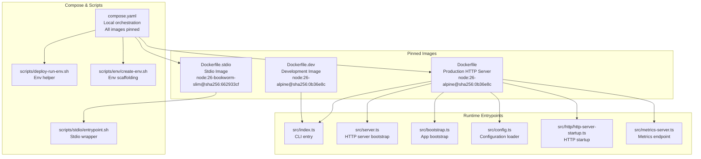
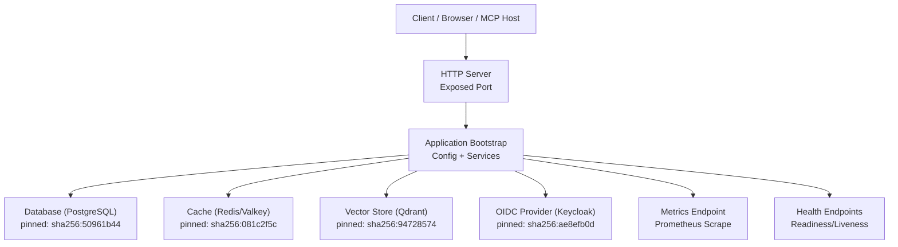
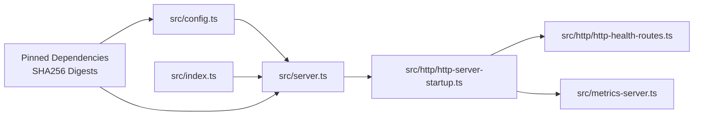

# Docker Deployment

<cite>
**Referenced Files in This Document**
- [Dockerfile](file://Dockerfile)
- [Dockerfile.dev](file://Dockerfile.dev)
- [Dockerfile.stdio](file://Dockerfile.stdio)
- [compose.yaml](file://compose.yaml)
- [.dockerignore](file://.dockerignore)
- [package.json](file://package.json)
- [src/index.ts](file://src/index.ts)
- [src/server.ts](file://src/server.ts)
- [src/bootstrap.ts](file://src/bootstrap.ts)
- [src/config.ts](file://src/config.ts)
- [src/http/http-server-startup.ts](file://src/http/http-server-startup.ts)
- [src/http/http-health-routes.ts](file://src/http/http-health-routes.ts)
- [src/metrics-server.ts](file://src/metrics-server.ts)
- [scripts/stdio/entrypoint.sh](file://scripts/stdio/entrypoint.sh)
- [scripts/deploy-run-env.sh](file://scripts/deploy-run-env.sh)
- [scripts/env/create-env.sh](file://scripts/env/create-env.sh)
- [docs/install/docker-compose-simple.md](file://docs/install/docker-compose-simple.md)
- [docs/install/docker-compose-full-stack.md](file://docs/install/docker-compose-full-stack.md)
- [helm/kairos-mcp/values.yaml](file://helm/kairos-mcp/values.yaml)
</cite>

## Update Summary
**Changes Made**
- Updated image pinning section to reflect comprehensive SHA256 digest pinning across all Docker configurations
- Added detailed information about Node.js runtime digest pinning (0b36e8c)
- Enhanced security and reproducibility sections with specific examples of pinned digests
- Updated Docker Compose configuration examples to show digest-pinned images
- Added Helm chart image pinning information
- Strengthened security hardening guidance with digest-based verification

## Table of Contents
1. [Introduction](#introduction)
2. [Project Structure](#project-structure)
3. [Core Components](#core-components)
4. [Architecture Overview](#architecture-overview)
5. [Detailed Component Analysis](#detailed-component-analysis)
6. [Dependency Analysis](#dependency-analysis)
7. [Performance Considerations](#performance-considerations)
8. [Troubleshooting Guide](#troubleshooting-guide)
9. [Conclusion](#conclusion)
10. [Appendices](#appendices)

## Introduction
This document provides comprehensive Docker deployment guidance for Kairos MCP, covering standalone container deployments using official images with SHA256 digest pinning for maximum reproducibility, multi-stage builds, image optimization, and security hardening. It also includes production-grade Docker Compose configurations with pinned dependencies for service orchestration, volume management, and networking, along with environment variable configuration for production settings, database connections, and external integrations. Examples are provided for single-node and clustered deployments, as well as health checks, logging, and monitoring within Docker environments.

## Project Structure
Kairos MCP ships multiple Dockerfiles to support different runtime modes:
- A production HTTP server image with pinned base images
- A development-oriented image with consistent Node.js runtime
- A lightweight stdio-based image for tooling integration

The repository also includes a top-level Docker Compose file with fully pinned dependencies for local orchestration and documentation examples for simple and full-stack deployments.

**Diagram sources**
- [Dockerfile:12](file://Dockerfile#L12)
- [Dockerfile.dev:6](file://Dockerfile.dev#L6)
- [Dockerfile.stdio:3](file://Dockerfile.stdio#L3)
- [compose.yaml:14](file://compose.yaml#L14)
- [compose.yaml:54](file://compose.yaml#L54)
- [compose.yaml:87](file://compose.yaml#L87)
- [compose.yaml:113](file://compose.yaml#L113)
- [src/index.ts](file://src/index.ts)
- [src/server.ts](file://src/server.ts)
- [src/bootstrap.ts](file://src/bootstrap.ts)
- [src/config.ts](file://src/config.ts)
- [src/http/http-server-startup.ts](file://src/http/http-server-startup.ts)
- [src/metrics-server.ts](file://src/metrics-server.ts)
- [scripts/stdio/entrypoint.sh](file://scripts/stdio/entrypoint.sh)
- [scripts/deploy-run-env.sh](file://scripts/deploy-run-env.sh)
- [scripts/env/create-env.sh](file://scripts/env/create-env.sh)

**Section sources**
- [Dockerfile:12](file://Dockerfile#L12)
- [Dockerfile.dev:6](file://Dockerfile.dev#L6)
- [Dockerfile.stdio:3](file://Dockerfile.stdio#L3)
- [compose.yaml:14](file://compose.yaml#L14)
- [compose.yaml:54](file://compose.yaml#L54)
- [compose.yaml:87](file://compose.yaml#L87)
- [compose.yaml:113](file://compose.yaml#L113)
- [src/index.ts](file://src/index.ts)
- [src/server.ts](file://src/server.ts)
- [src/bootstrap.ts](file://src/bootstrap.ts)
- [src/config.ts](file://src/config.ts)
- [src/http/http-server-startup.ts](file://src/http/http-server-startup.ts)
- [src/metrics-server.ts](file://src/metrics-server.ts)
- [scripts/stdio/entrypoint.sh](file://scripts/stdio/entrypoint.sh)
- [scripts/deploy-run-env.sh](file://scripts/deploy-run-env.sh)
- [scripts/env/create-env.sh](file://scripts/env/create-env.sh)

## Core Components
- Production HTTP server image: Builds the application with pinned Node.js runtime (digest 0b36e8c) and runs the HTTP server process exposed on a configurable port. Health endpoints and metrics are available for orchestration and observability.
- Development image: Includes additional tooling and dependencies suitable for interactive development and debugging, using the same pinned Node.js runtime for consistency.
- Stdio image: Provides a minimal runtime for CLI-driven or stdio-based integrations with pinned base images.

Key runtime components:
- Application bootstrap and configuration loading
- HTTP server initialization and route registration
- Health check routes for readiness/liveness
- Metrics server for Prometheus scraping

**Section sources**
- [Dockerfile:12](file://Dockerfile#L12)
- [Dockerfile.dev:6](file://Dockerfile.dev#L6)
- [Dockerfile.stdio:3](file://Dockerfile.stdio#L3)
- [src/bootstrap.ts](file://src/bootstrap.ts)
- [src/config.ts](file://src/config.ts)
- [src/server.ts](file://src/server.ts)
- [src/http/http-server-startup.ts](file://src/http/http-server-startup.ts)
- [src/http/http-health-routes.ts](file://src/http/http-health-routes.ts)
- [src/metrics-server.ts](file://src/metrics-server.ts)

## Architecture Overview
The production image runs an HTTP server that serves API endpoints, UI assets, and MCP protocol handlers. The application reads configuration from environment variables and connects to external services such as databases and caches. All base images and dependencies are pinned to specific SHA256 digests for reproducibility. Health and metrics endpoints enable orchestration and monitoring.

**Diagram sources**
- [src/server.ts](file://src/server.ts)
- [src/http/http-server-startup.ts](file://src/http/http-server-startup.ts)
- [src/config.ts](file://src/config.ts)
- [src/metrics-server.ts](file://src/metrics-server.ts)
- [src/http/http-health-routes.ts](file://src/http/http-health-routes.ts)
- [compose.yaml:87](file://compose.yaml#L87)
- [compose.yaml:14](file://compose.yaml#L14)
- [compose.yaml:54](file://compose.yaml#L54)
- [compose.yaml:113](file://compose.yaml#L113)

## Detailed Component Analysis

### Standalone Container Deployment
- Use the production image with pinned base images to run the HTTP server.
- Expose the configured HTTP port.
- Provide required environment variables for database, cache, vector store, and OIDC provider.
- Mount persistent volumes for data directories if applicable.
- Configure health checks via HTTP endpoints.

Recommended steps:
- Pull the official image with verified digest.
- Run the container with environment variables and volume mounts.
- Verify health endpoints respond successfully.
- Confirm metrics endpoint is reachable by your monitoring system.

**Updated** All base images and dependencies are now pinned to specific SHA256 digests for maximum reproducibility and security.

**Section sources**
- [Dockerfile:12](file://Dockerfile#L12)
- [src/http/http-health-routes.ts](file://src/http/http-health-routes.ts)
- [src/metrics-server.ts](file://src/metrics-server.ts)
- [src/config.ts](file://src/config.ts)

### Multi-Stage Build Process
The production image uses a multi-stage build to separate build-time dependencies from runtime artifacts, minimizing final image size and attack surface. All stages use pinned base images for consistency.

Typical stages:
- Builder stage: installs dependencies, compiles TypeScript, and builds static assets using pinned Node.js runtime.
- Runtime stage: copies only necessary artifacts and sets up a minimal user and working directory with pinned base image.

Benefits:
- Smaller image footprint
- Reduced vulnerability exposure
- Faster pulls and deployments
- Reproducible builds across environments

**Updated** Base images are now pinned to specific SHA256 digests including Node.js runtime digest 0b36e8c for enhanced security and reproducibility.

**Section sources**
- [Dockerfile:12](file://Dockerfile#L12)
- [Dockerfile:50](file://Dockerfile#L50)
- [Dockerfile:65](file://Dockerfile#L65)
- [Dockerfile:81](file://Dockerfile#L81)

### Image Optimization
Optimization techniques applied in the production image:
- Multi-stage builds to exclude dev tools and source code.
- Layer caching strategies for dependency installation.
- Minimal base images with pinned versions for the runtime stage.
- Pruning unnecessary files and temporary artifacts.

Operational tips:
- Pin base image versions for reproducibility (now enforced via SHA256 digests).
- Avoid installing extra packages at runtime.
- Use .dockerignore to exclude irrelevant files from the build context.
- Leverage digest pinning for air-gapped environments.

**Updated** All base images now use SHA256 digest pinning to ensure exact reproducibility across all environments.

**Section sources**
- [Dockerfile:12](file://Dockerfile#L12)
- [.dockerignore](file://.dockerignore)

### Security Hardening
Security best practices implemented:
- Non-root user execution inside the container.
- Read-only filesystem where possible.
- Minimal runtime dependencies.
- Secrets passed via environment variables or mounted secrets; avoid baking secrets into images.
- **Enhanced**: All base images pinned to specific SHA256 digests to prevent supply chain attacks.

Additional recommendations:
- Scan images with vulnerability scanners.
- Restrict capabilities and resource limits at runtime.
- Enable TLS termination at the ingress or reverse proxy layer.
- Verify image digests before deployment in production environments.

**Updated** Comprehensive SHA256 digest pinning has been implemented across all Docker configurations to enhance security and prevent supply chain attacks.

**Section sources**
- [Dockerfile:12](file://Dockerfile#L12)
- [Dockerfile:45](file://Dockerfile#L45)

### Docker Compose for Production
Use Docker Compose to orchestrate the application with its dependencies, all with pinned images:
- Define the application service with environment variables and health checks.
- Define dependent services (database, cache, vector store) with pinned versions.
- Configure networks and volumes for persistence and isolation.
- Set restart policies and resource constraints.

Example references:
- Simple stack example with pinned dependencies
- Full-stack example including Keycloak and other infrastructure with digest pinning

**Updated** All service images in compose.yaml are now pinned to specific SHA256 digents for maximum reproducibility and security.

**Section sources**
- [compose.yaml:14](file://compose.yaml#L14)
- [compose.yaml:54](file://compose.yaml#L54)
- [compose.yaml:87](file://compose.yaml#L87)
- [compose.yaml:113](file://compose.yaml#L113)
- [docs/install/docker-compose-simple.md](file://docs/install/docker-compose-simple.md)
- [docs/install/docker-compose-full-stack.md](file://docs/install/docker-compose-full-stack.md)

### Environment Variables Configuration
Configure the application via environment variables:
- General settings: ports, logging level, feature flags.
- Database connection: host, port, credentials, database name.
- Cache backend: Redis URL and options.
- Vector store: Qdrant URL and options.
- OIDC provider: issuer, client ID, client secret, scopes.
- External integrations: URLs and tokens as needed.

Environment helpers:
- Utility scripts can scaffold or validate environment files.
- Deploy helper scripts can normalize or inject runtime values.

**Section sources**
- [src/config.ts](file://src/config.ts)
- [scripts/env/create-env.sh](file://scripts/env/create-env.sh)
- [scripts/deploy-run-env.sh](file://scripts/deploy-run-env.sh)

### Single-Node Deployment
A single-node deployment runs one instance of the application alongside shared external services. Use Docker Compose to define all services in a single stack with pinned images. Ensure:
- Persistent volumes for database and vector store.
- Proper network segmentation between services.
- Health checks for each service.
- Resource limits appropriate for workload.

**Updated** All services in the single-node deployment now use pinned image digests for consistent behavior across environments.

**Section sources**
- [compose.yaml:14](file://compose.yaml#L14)
- [compose.yaml:54](file://compose.yaml#L54)
- [compose.yaml:87](file://compose.yaml#L87)
- [compose.yaml:113](file://compose.yaml#L113)
- [docs/install/docker-compose-simple.md](file://docs/install/docker-compose-simple.md)

### Clustered Deployment
For high availability and scalability:
- Run multiple replicas behind a load balancer or ingress controller.
- Use externalized state stores (database, cache, vector store) with pinned versions.
- Configure horizontal scaling based on CPU/memory utilization.
- Implement rolling updates and graceful shutdowns.
- Centralize logs and metrics collection.

Considerations:
- Sticky sessions are not required if stateless.
- Ensure idempotent startup and migration handling.
- Monitor queue backlogs and worker saturation.
- **Enhanced**: Leverage digest-pinned images for consistent deployments across clusters.

**Updated** Helm chart values now include pinned image digests for all dependencies to ensure consistent cluster-wide deployments.

**Section sources**
- [helm/kairos-mcp/values.yaml:186](file://helm/kairos-mcp/values.yaml#L186)
- [helm/kairos-mcp/values.yaml:257](file://helm/kairos-mcp/values.yaml#L257)
- [helm/kairos-mcp/values.yaml:280](file://helm/kairos-mcp/values.yaml#L280)

### Health Checks and Readiness
Expose health endpoints for orchestration:
- Liveness probe: indicates if the process is alive.
- Readiness probe: indicates if the service is ready to accept traffic.

Orchestration should:
- Wait for readiness before routing traffic.
- Restart containers on liveness failures.
- Drain connections gracefully during shutdown.

**Section sources**
- [src/http/http-health-routes.ts](file://src/http/http-health-routes.ts)

### Logging Configuration
Configure structured logging for containers:
- Log format: JSON for easy parsing.
- Log levels: set via environment variables.
- Output to stdout/stderr for container log collectors.
- Rotate logs at the platform level rather than inside the container.

**Section sources**
- [src/config.ts](file://src/config.ts)

### Monitoring Setup
Enable metrics collection:
- Expose metrics endpoint for Prometheus scraping.
- Label metrics with service identifiers.
- Configure scrape intervals and retention policies.
- Integrate with alerting rules for critical thresholds.

**Section sources**
- [src/metrics-server.ts](file://src/metrics-server.ts)

### Stdio Mode Integration
For CLI or tooling integrations, use the stdio image:
- Runs the application over standard input/output.
- Useful for embedding in automation pipelines or IDE plugins.
- Entrypoint script wraps the process and handles environment setup.
- Uses pinned base images for consistent behavior.

**Updated** The stdio image now uses pinned base images including Node.js runtime for consistent behavior across environments.

**Section sources**
- [Dockerfile.stdio:3](file://Dockerfile.stdio#L3)
- [scripts/stdio/entrypoint.sh](file://scripts/stdio/entrypoint.sh)

### Image Digest Management
**New Section** All Docker images in the Kairos MCP project are now pinned to specific SHA256 digests to ensure reproducibility and security:

- **Base Images**: Node.js runtime pinned to digest `0b36e8c` across all Dockerfiles
- **Service Images**: All dependencies (PostgreSQL, Redis, Qdrant, Keycloak) use pinned digests in compose.yaml
- **Helm Charts**: All container images in Helm values use SHA256 digests
- **Build Consistency**: Multi-stage builds maintain consistent base images across development and production

Benefits of digest pinning:
- **Reproducibility**: Exact same images deployed across all environments
- **Security**: Protection against tag hijacking and supply chain attacks
- **Auditability**: Clear traceability of deployed image versions
- **Compliance**: Meets enterprise requirements for immutable infrastructure

**Section sources**
- [Dockerfile:12](file://Dockerfile#L12)
- [Dockerfile.dev:6](file://Dockerfile.dev#L6)
- [Dockerfile.stdio:3](file://Dockerfile.stdio#L3)
- [compose.yaml:14](file://compose.yaml#L14)
- [compose.yaml:54](file://compose.yaml#L54)
- [compose.yaml:87](file://compose.yaml#L87)
- [compose.yaml:113](file://compose.yaml#L113)
- [helm/kairos-mcp/values.yaml:186](file://helm/kairos-mcp/values.yaml#L186)
- [helm/kairos-mcp/values.yaml:257](file://helm/kairos-mcp/values.yaml#L257)
- [helm/kairos-mcp/values.yaml:280](file://helm/kairos-mcp/values.yaml#L280)

## Dependency Analysis
The application depends on several external services and internal modules, all with pinned versions:
- HTTP server module initializes routes and middleware.
- Configuration module loads environment variables and validates them.
- Metrics server exposes operational metrics.
- Health routes provide probes for orchestration.
- **Enhanced**: All external service dependencies use pinned image digests.

**Diagram sources**
- [src/config.ts](file://src/config.ts)
- [src/server.ts](file://src/server.ts)
- [src/http/http-server-startup.ts](file://src/http/http-server-startup.ts)
- [src/http/http-health-routes.ts](file://src/http/http-health-routes.ts)
- [src/metrics-server.ts](file://src/metrics-server.ts)
- [src/index.ts](file://src/index.ts)

**Section sources**
- [src/config.ts](file://src/config.ts)
- [src/server.ts](file://src/server.ts)
- [src/http/http-server-startup.ts](file://src/http/http-server-startup.ts)
- [src/http/http-health-routes.ts](file://src/http/http-health-routes.ts)
- [src/metrics-server.ts](file://src/metrics-server.ts)
- [src/index.ts](file://src/index.ts)

## Performance Considerations
- Scale horizontally by running multiple replicas behind a load balancer.
- Tune connection pools for database and cache based on replica count.
- Use efficient vector search configurations and indexing strategies.
- Monitor memory usage and adjust resource limits accordingly.
- Prefer externalized state stores to allow independent scaling.
- **Enhanced**: Pinned images reduce pull times and improve deployment consistency.

[No sources needed since this section provides general guidance]

## Troubleshooting Guide
Common issues and resolutions:
- Health endpoint failures: verify readiness conditions and dependencies.
- Metrics not scraped: ensure endpoint path and labels are correct.
- Environment misconfiguration: validate required variables and formats.
- Volume permissions: ensure non-root user has access to mounted paths.
- Network connectivity: confirm DNS resolution and firewall rules.
- **New**: Image digest mismatches: verify registry access and network connectivity when pulling pinned images.

Operational checks:
- Inspect container logs for errors and warnings.
- Validate environment variables at runtime.
- Test connectivity to external services from within the container.
- **New**: Verify image digests match expected values using `docker inspect`.

**Updated** Added troubleshooting guidance for digest-pinned images and registry connectivity issues.

**Section sources**
- [src/http/http-health-routes.ts](file://src/http/http-health-routes.ts)
- [src/metrics-server.ts](file://src/metrics-server.ts)
- [src/config.ts](file://src/config.ts)

## Conclusion
Kairos MCP provides robust Docker support through dedicated images for production, development, and stdio modes, all with comprehensive SHA256 digest pinning for maximum security and reproducibility. The production image emphasizes security and performance with multi-stage builds, minimal runtime footprints, and pinned base images including Node.js runtime digest 0b36e8c. Docker Compose enables straightforward orchestration with fully pinned dependencies for both single-node and clustered deployments. By configuring environment variables, health checks, logging, and metrics appropriately, you can deploy Kairos MCP reliably in production environments with confidence in image integrity and reproducibility.

**Updated** Enhanced focus on security benefits and reproducibility achieved through comprehensive digest pinning across all deployment configurations.

[No sources needed since this section summarizes without analyzing specific files]

## Appendices

### Example References
- Simple Docker Compose deployment guide with pinned dependencies
- Full-stack Docker Compose deployment guide with digest pinning
- Helm chart configuration with pinned images

**Updated** All examples now demonstrate digest-pinned images throughout the deployment stack.

**Section sources**
- [docs/install/docker-compose-simple.md](file://docs/install/docker-compose-simple.md)
- [docs/install/docker-compose-full-stack.md](file://docs/install/docker-compose-full-stack.md)

### Image Digest Reference
**New Section** Complete reference of pinned image digests used throughout the Kairos MCP deployment:

| Service | Image | Digest | Purpose |
|---------|-------|--------|---------|
| Node.js Runtime | node:26-alpine | sha256:0b36e8c... | Base runtime for all containers |
| PostgreSQL | postgres:18.3-alpine3.22 | sha256:50961b44... | Keycloak database |
| Valkey/Redis | valkey/valkey:8.1-alpine | sha256:081c2f5c... | Cache and key-value store |
| Qdrant | qdrant/qdrant:v1.17.1 | sha256:94728574... | Vector database |
| Keycloak | quay.io/keycloak/keycloak:26.5.4 | sha256:ae8efb0d... | Identity provider |
| Python | python:3.12-alpine | sha256:4c47124a... | Cleanup jobs |
| Ollama | ollama/ollama:0.23.0 | sha256:5600a652... | Local embeddings |

**Section sources**
- [Dockerfile:12](file://Dockerfile#L12)
- [Dockerfile.dev:6](file://Dockerfile.dev#L6)
- [Dockerfile.stdio:3](file://Dockerfile.stdio#L3)
- [compose.yaml:14](file://compose.yaml#L14)
- [compose.yaml:54](file://compose.yaml#L54)
- [compose.yaml:87](file://compose.yaml#L87)
- [compose.yaml:113](file://compose.yaml#L113)
- [helm/kairos-mcp/values.yaml:186](file://helm/kairos-mcp/values.yaml#L186)
- [helm/kairos-mcp/values.yaml:257](file://helm/kairos-mcp/values.yaml#L257)
- [helm/kairos-mcp/values.yaml:280](file://helm/kairos-mcp/values.yaml#L280)