# Continuous Integration and Automation

<cite>
**Referenced Files in This Document**
- [package.json](file://package.json)
- [.github/workflows/integration.yml](file://.github/workflows/integration.yml)
- [.github/workflows/release.yml](file://.github/workflows/release.yml)
- [.github/workflows/security.yml](file://.github/workflows/security.yml)
- [.github/workflows/npm-audit-fix.yml](file://.github/workflows/npm-audit-fix.yml)
- [.github/workflows/automation-health.yml](file://.github/workflows/automation-health.yml)
- [.github/workflows/automation-policy.yml](file://.github/workflows/automation-policy.yml)
- [.github/workflows/renovate.yml](file://.github/workflows/renovate.yml)
- [.github/dependabot.yml](file://.github/dependabot.yml)
- [.husky/pre-commit](file://.husky/pre-commit)
- [.trivyignore](file://.trivyignore)
- [scripts/ci-parallel-checks.mjs](file://scripts/ci-parallel-checks.mjs)
- [scripts/ci-github-step-summary.mjs](file://scripts/ci-github-step-summary.mjs)
- [scripts/ci-test-tgz-install.mjs](file://scripts/ci-test-tgz-install.mjs)
- [scripts/ci-wait-for-infra.sh](file://scripts/ci-wait-for-infra.sh)
- [scripts/test-helm.sh](file://scripts/test-helm.sh)
- [scripts/import-test-snapshot.sh](file://scripts/import-test-snapshot.sh)
- [scripts/seed-test-snapshot.sh](file://scripts/seed-test-snapshot.sh)
- [scripts/build-embed-docs.ts](file://scripts/build-embed-docs.ts)
- [scripts/build-vite-ui-env-define.ts](file://scripts/build-vite-ui-env-define.ts)
- [scripts/deploy-run-env.sh](file://scripts/deploy-run-env.sh)
- [scripts/env/create-env.sh](file://scripts/env/create-env.sh)
- [scripts/stdio/entrypoint.sh](file://scripts/stdio/entrypoint.sh)
- [scripts/npm-audit-fix.sh](file://scripts/npm-audit-fix.sh)
- [scripts/helm-set-release-version.mjs](file://scripts/helm-set-release-version.mjs)
- [scripts/ci-release.mjs](file://scripts/ci-release.mjs)
- [scripts/ci-release-state.mjs](file://scripts/ci-release-state.mjs)
- [scripts/ci-health.mjs](file://scripts/ci-health.mjs)
- [scripts/ci-automation.mjs](file://scripts/ci-automation.mjs)
- [release.config.mjs](file://release.config.mjs)
- [Dockerfile](file://Dockerfile)
- [Dockerfile.dev](file://Dockerfile.dev)
- [Dockerfile.stdio](file://Dockerfile.stdio)
- [compose.yaml](file://compose.yaml)
- [tests/jest-sequencer.cjs](file://tests/jest-sequencer.cjs)
- [tests/reporters/jest-github-summary-reporter.cjs](file://tests/reporters/jest-github-summary-reporter.cjs)
- [knip.config.ts](file://knip.config.ts)
- [eslint/flat-config.cjs](file://eslint/flat-config.cjs)
</cite>

## Update Summary
**Changes Made**
- Enhanced security workflow with intelligent auto-remediation for npm vulnerabilities and container base image issues
- Removed automerge-dependabot.yml and ci-failure-auto-fix.yml workflows as they are no longer needed
- Updated Dockerfile with security patches for vulnerable packages including brace-expansion, undici, and ip-address addressing multiple CVEs
- Transformed security scanning from passive to active remediation system
- Leveraged native GitHub auto-merge for Dependabot PRs instead of custom automation

## Table of Contents
1. [Introduction](#introduction)
2. [Project Structure](#project-structure)
3. [Core Components](#core-components)
4. [Architecture Overview](#architecture-overview)
5. [Detailed Component Analysis](#detailed-component-analysis)
6. [Dependency Analysis](#dependency-analysis)
7. [Performance Considerations](#performance-considerations)
8. [Troubleshooting Guide](#troubleshooting-guide)
9. [Conclusion](#conclusion)
10. [Appendices](#appendices)

## Introduction
This document explains the continuous integration setup and automation workflows for Kairos MCP. It covers GitHub Actions configuration for automated testing, building, and deployment; parallel test execution strategy and performance optimizations; pre-commit hooks with Husky; CI pipeline stages, job dependencies, and artifact management; security scanning and compliance checks; caching strategies; debugging guidance; and examples of custom CI scripts and automation tasks.

The CI/CD system has undergone a complete redesign featuring semantic-release integration, unified release pipeline with branch-based release type detection, automated security maintenance, Copilot-powered CI failure auto-fix, OIDC trusted publishing for npm packages, and container registry migration to jakubplichcinski/kairos-mcp. The new architecture provides a single manual dispatch that publishes npm packages, container images (Docker Hub + Quay), Helm charts, git tags, and GitHub Releases from one SemVer version computed by semantic-release, with release types automatically derived from branch context instead of requiring explicit operator configuration.

**Updated** The security workflow has been transformed from passive scanning to an active remediation system with intelligent auto-remediation for npm vulnerabilities and container base image issues. The automerge-dependabot.yml and ci-failure-auto-fix.yml workflows have been removed as native GitHub auto-merge now handles Dependabot PRs and the Copilot-based CI failure auto-fix was removed due to duplicate PR bugs. The Dockerfile includes comprehensive security patches for vulnerable packages including brace-expansion, undici, and ip-address addressing multiple CVEs.

## Project Structure
The CI and automation surface is composed of:
- Unified GitHub Actions workflows under .github/workflows with consolidated integration testing and release management
- Automated security maintenance workflows with intelligent auto-remediation capabilities
- Custom CI scripts under scripts for parallel execution and infrastructure provisioning
- Test orchestration and reporting under tests
- Containerization and local dev tooling via Dockerfiles and compose files
- Pre-commit hooks under .husky
- Security scanning configuration (.trivyignore)
- Dependency updates via Dependabot
- Build configuration files (knip.config.ts, eslint/flat-config.cjs)
- Automation health monitoring and policy enforcement workflows

```mermaid
graph TB
subgraph "CI Orchestration"
GH["GitHub Actions"]
W1[".github/workflows/integration.yml"]
W2[".github/workflows/release.yml"]
W3[".github/workflows/security.yml"]
W4[".github/workflows/npm-audit-fix.yml"]
W5[".github/workflows/automation-health.yml"]
W6[".github/workflows/automation-policy.yml"]
W7[".github/workflows/renovate.yml"]
DEP[".github/dependabot.yml"]
end
subgraph "Scripts"
PAR["scripts/ci-parallel-checks.mjs"]
SUM["scripts/ci-github-step-summary.mjs"]
TGZ["scripts/ci-test-tgz-install.mjs"]
INFRA["scripts/ci-wait-for-infra.sh"]
HELM["scripts/test-helm.sh"]
SNAP_I["scripts/import-test-snapshot.sh"]
SNAP_S["scripts/seed-test-snapshot.sh"]
BUILD_E["scripts/build-embed-docs.ts"]
VITE_D["scripts/build-vite-ui-env-define.ts"]
RUN_ENV["scripts/deploy-run-env.sh"]
ENV_C["scripts/env/create-env.sh"]
STDIO_EP["scripts/stdio/entrypoint.sh"]
AUDIT_FIX["scripts/npm-audit-fix.sh"]
HELM_VER["scripts/helm-set-release-version.mjs"]
RELEASE["scripts/ci-release.mjs"]
RELEASE_STATE["scripts/ci-release-state.mjs"]
HEALTH["scripts/ci-health.mjs"]
AUTOMATION["scripts/ci-automation.mjs"]
end
subgraph "Tests"
JCFG["jest.config.js"]
VCFG["vitest.config.ts"]
SEQ["tests/jest-sequencer.cjs"]
RPT["tests/reporters/jest-github-summary-reporter.cjs"]
end
subgraph "Containers"
DKR["Dockerfile"]
DKRD["Dockerfile.dev"]
DKRS["Dockerfile.stdio"]
CMP["compose.yaml"]
end
subgraph "Hooks & Security"
HUSKY[".husky/pre-commit"]
TRIVY[".trivyignore"]
end
subgraph "Build Config"
KNIP["knip.config.ts"]
ESLINT["eslint/flat-config.cjs"]
PKG["package.json"]
SR["release.config.mjs"]
end
GH --> W1
GH --> W2
GH --> W3
GH --> W4
GH --> W5
GH --> W6
GH --> W7
W1 --> PAR
W1 --> SUM
W1 --> TGZ
W1 --> INFRA
W1 --> HELM
W1 --> SNAP_I
W1 --> SNAP_S
W1 --> BUILD_E
W1 --> VITE_D
W1 --> RUN_ENV
W1 --> ENV_C
W1 --> STDIO_EP
W1 --> JCFG
W1 --> VCFG
W1 --> SEQ
W1 --> RPT
W1 --> DKR
W1 --> DKRD
W1 --> DKRS
W1 --> CMP
W1 --> HUSKY
W1 --> TRIVY
W1 --> KNIP
W1 --> ESLINT
W1 --> PKG
W4 --> AUDIT_FIX
W2 --> SR
W2 --> HELM_VER
W2 --> RELEASE
W2 --> RELEASE_STATE
W5 --> HEALTH
HEALTH --> AUTOMATION
GH --> DEP
```

**Diagram sources**
- [.github/workflows/integration.yml](file://.github/workflows/integration.yml)
- [.github/workflows/release.yml](file://.github/workflows/release.yml)
- [.github/workflows/security.yml](file://.github/workflows/security.yml)
- [.github/workflows/npm-audit-fix.yml](file://.github/workflows/npm-audit-fix.yml)
- [.github/workflows/automation-health.yml](file://.github/workflows/automation-health.yml)
- [.github/workflows/automation-policy.yml](file://.github/workflows/automation-policy.yml)
- [.github/workflows/renovate.yml](file://.github/workflows/renovate.yml)
- [.github/dependabot.yml](file://.github/dependabot.yml)
- [scripts/ci-parallel-checks.mjs](file://scripts/ci-parallel-checks.mjs)
- [scripts/ci-github-step-summary.mjs](file://scripts/ci-github-step-summary.mjs)
- [scripts/ci-test-tgz-install.mjs](file://scripts/ci-test-tgz-install.mjs)
- [scripts/ci-wait-for-infra.sh](file://scripts/ci-wait-for-infra.sh)
- [scripts/test-helm.sh](file://scripts/test-helm.sh)
- [scripts/import-test-snapshot.sh](file://scripts/import-test-snapshot.sh)
- [scripts/seed-test-snapshot.sh](file://scripts/seed-test-snapshot.sh)
- [scripts/build-embed-docs.ts](file://scripts/build-embed-docs.ts)
- [scripts/build-vite-ui-env-define.ts](file://scripts/build-vite-ui-env-define.ts)
- [scripts/deploy-run-env.sh](file://scripts/deploy-run-env.sh)
- [scripts/env/create-env.sh](file://scripts/env/create-env.sh)
- [scripts/stdio/entrypoint.sh](file://scripts/stdio/entrypoint.sh)
- [scripts/npm-audit-fix.sh](file://scripts/npm-audit-fix.sh)
- [scripts/helm-set-release-version.mjs](file://scripts/helm-set-release-version.mjs)
- [scripts/ci-release.mjs](file://scripts/ci-release.mjs)
- [scripts/ci-release-state.mjs](file://scripts/ci-release-state.mjs)
- [scripts/ci-health.mjs](file://scripts/ci-health.mjs)
- [scripts/ci-automation.mjs](file://scripts/ci-automation.mjs)
- [release.config.mjs](file://release.config.mjs)
- [jest.config.js](file://jest.config.js)
- [vitest.config.ts](file://vitest.config.ts)
- [tests/jest-sequencer.cjs](file://tests/jest-sequencer.cjs)
- [tests/reporters/jest-github-summary-reporter.cjs](file://tests/reporters/jest-github-summary-reporter.cjs)
- [Dockerfile](file://Dockerfile)
- [Dockerfile.dev](file://Dockerfile.dev)
- [Dockerfile.stdio](file://Dockerfile.stdio)
- [compose.yaml](file://compose.yaml)
- [.husky/pre-commit](file://.husky/pre-commit)
- [.trivyignore](file://.trivyignore)
- [knip.config.ts](file://knip.config.ts)
- [eslint/flat-config.cjs](file://eslint/flat-config.cjs)
- [package.json](file://package.json)

**Section sources**
- [.github/workflows/integration.yml](file://.github/workflows/integration.yml)
- [.github/workflows/release.yml](file://.github/workflows/release.yml)
- [.github/workflows/security.yml](file://.github/workflows/security.yml)
- [.github/workflows/npm-audit-fix.yml](file://.github/workflows/npm-audit-fix.yml)
- [.github/workflows/automation-health.yml](file://.github/workflows/automation-health.yml)
- [.github/workflows/automation-policy.yml](file://.github/workflows/automation-policy.yml)
- [.github/workflows/renovate.yml](file://.github/workflows/renovate.yml)
- [.github/dependabot.yml](file://.github/dependabot.yml)
- [package.json](file://package.json)
- [jest.config.js](file://jest.config.js)
- [vitest.config.ts](file://vitest.config.ts)
- [tests/jest-sequencer.cjs](file://tests/jest-sequencer.cjs)
- [tests/reporters/jest-github-summary-reporter.cjs](file://tests/reporters/jest-github-summary-reporter.cjs)
- [Dockerfile](file://Dockerfile)
- [Dockerfile.dev](file://Dockerfile.dev)
- [Dockerfile.stdio](file://Dockerfile.stdio)
- [compose.yaml](file://compose.yaml)
- [.husky/pre-commit](file://.husky/pre-commit)
- [.trivyignore](file://.trivyignore)
- [knip.config.ts](file://knip.config.ts)
- [eslint/flat-config.cjs](file://eslint/flat-config.cjs)

## Core Components
- **Modular Release Pipeline with Artifact Communication**: Single workflow orchestrating semantic-release with automatic release type derivation from branch context, separated into resolve, prepare, and publish jobs communicating through GitHub Actions artifacts and draft releases
- **Enhanced Security Workflow with Intelligent Auto-Remediation**: Active remediation system that automatically fixes npm vulnerabilities and updates container base images, transforming from passive scanning to proactive security maintenance
- **Automated Security Maintenance**: Daily npm audit fix workflow that automatically creates PRs for dependency vulnerabilities with intelligent retry logic
- **Multi-Registry Container Publishing**: Single build-push operation publishing to both Docker Hub and Quay with keyless signing
- **Consolidated Integration Testing**: Streamlined workflow with path filtering, matrix builds, and optimized resource allocation
- **Parallel Test Executor**: Splits suites across workers to maximize throughput with enhanced distribution logic
- **Reporting and Summaries**: Produces GitHub-friendly summaries and test reports with consolidated results
- **Infrastructure Provisioning**: Waits for external services (e.g., Keycloak, Redis, Qdrant) before running tests
- **Helm Chart Validation**: Runs chart linting and tests with idempotent publishing support
- **Snapshot Import/Seed**: Prepares deterministic test data
- **Build Helpers**: UI environment definition and embedded docs build
- **Streamlined Build Configuration**: Optimized npm scripts with removal of deprecated references and enhanced wiki synchronization
- **Container Images with Security Patches**: Multi-stage builds for app, dev, and stdio variants with comprehensive vulnerability patches
- **Local Automation**: Husky pre-commit hook to enforce quality gates locally
- **Security Scanning**: Trivy vulnerability scanning with ignore rules and CodeQL analysis
- **Dependency Updates**: Dependabot configuration for automated PRs with native GitHub auto-merge
- **Enhanced Configuration Management**: Updated knip.config.ts and eslint/flat-config.cjs for improved code analysis
- **Automation Health Monitoring**: Detects stale producers and incomplete releases with incident deduplication and enhanced skipped workflow handling
- **Automation Policy Enforcement**: Validates conventional commits, workflow configurations, and automation regressions

**Section sources**
- [.github/workflows/release.yml](file://.github/workflows/release.yml)
- [.github/workflows/security.yml](file://.github/workflows/security.yml)
- [.github/workflows/npm-audit-fix.yml](file://.github/workflows/npm-audit-fix.yml)
- [.github/workflows/integration.yml](file://.github/workflows/integration.yml)
- [.github/workflows/automation-health.yml](file://.github/workflows/automation-health.yml)
- [.github/workflows/automation-policy.yml](file://.github/workflows/automation-policy.yml)
- [.github/workflows/renovate.yml](file://.github/workflows/renovate.yml)
- [scripts/ci-parallel-checks.mjs](file://scripts/ci-parallel-checks.mjs)
- [scripts/ci-github-step-summary.mjs](file://scripts/ci-github-step-summary.mjs)
- [scripts/ci-wait-for-infra.sh](file://scripts/ci-wait-for-infra.sh)
- [scripts/test-helm.sh](file://scripts/test-helm.sh)
- [scripts/import-test-snapshot.sh](file://scripts/import-test-snapshot.sh)
- [scripts/seed-test-snapshot.sh](file://scripts/seed-test-snapshot.sh)
- [scripts/build-embed-docs.ts](file://scripts/build-embed-docs.ts)
- [scripts/build-vite-ui-env-define.ts](file://scripts/build-vite-ui-env-define.ts)
- [Dockerfile](file://Dockerfile)
- [Dockerfile.dev](file://Dockerfile.dev)
- [Dockerfile.stdio](file://Dockerfile.stdio)
- [.husky/pre-commit](file://.husky/pre-commit)
- [.trivyignore](file://.trivyignore)
- [.github/dependabot.yml](file://.github/dependabot.yml)
- [knip.config.ts](file://knip.config.ts)
- [eslint/flat-config.cjs](file://eslint/flat-config.cjs)

## Architecture Overview
The CI architecture coordinates multiple jobs that share caches and artifacts with a streamlined workflow structure. Jobs are grouped into logical stages: validate, build, test (multi-phase), package, publish, and finalize. Matrix strategies run subsets in parallel with optimized resource allocation. Artifacts are uploaded for later jobs or manual inspection.

**Updated** The security workflow has been transformed from passive scanning to an active remediation system with intelligent auto-remediation for npm vulnerabilities and container base image issues. The automerge-dependabot.yml and ci-failure-auto-fix.yml workflows have been removed as native GitHub auto-merge now handles Dependabot PRs and the Copilot-based CI failure auto-fix was removed due to duplicate PR bugs. The Dockerfile includes comprehensive security patches for vulnerable packages including brace-expansion, undici, and ip-address addressing multiple CVEs.

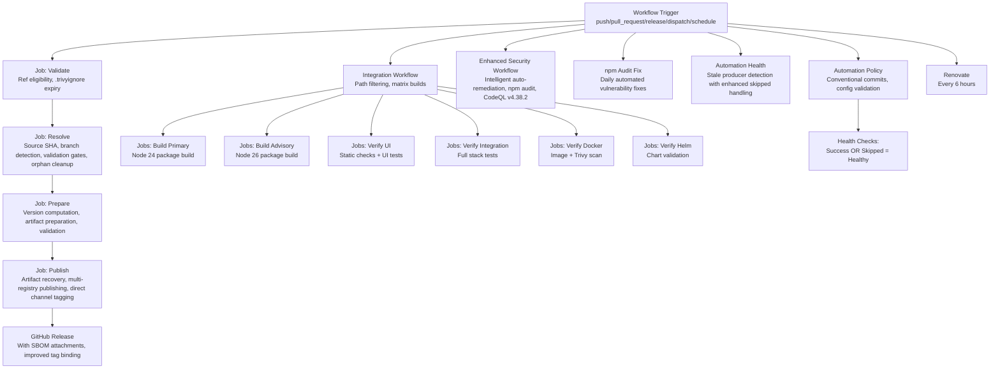

**Diagram sources**
- [.github/workflows/release.yml](file://.github/workflows/release.yml)
- [.github/workflows/integration.yml](file://.github/workflows/integration.yml)
- [.github/workflows/security.yml](file://.github/workflows/security.yml)
- [.github/workflows/npm-audit-fix.yml](file://.github/workflows/npm-audit-fix.yml)
- [.github/workflows/automation-health.yml](file://.github/workflows/automation-health.yml)
- [.github/workflows/automation-policy.yml](file://.github/workflows/automation-policy.yml)
- [.github/workflows/renovate.yml](file://.github/workflows/renovate.yml)
- [scripts/ci-parallel-checks.mjs](file://scripts/ci-parallel-checks.mjs)
- [scripts/ci-github-step-summary.mjs](file://scripts/ci-github-step-summary.mjs)
- [scripts/ci-wait-for-infra.sh](file://scripts/ci-wait-for-infra.sh)
- [scripts/test-helm.sh](file://scripts/test-helm.sh)
- [tests/reporters/jest-github-summary-reporter.cjs](file://tests/reporters/jest-github-summary-reporter.cjs)
- [scripts/ci-health.mjs](file://scripts/ci-health.mjs)

## Detailed Component Analysis

### Enhanced Security Workflow with Intelligent Auto-Remediation
**Updated** The security workflow has been completely transformed from passive scanning to an active remediation system that automatically fixes vulnerabilities without human intervention.

- **Intelligent npm Vulnerability Detection**: Filters out vulnerabilities only present in npm's bundled dependencies, focusing on actual project vulnerabilities
- **Automatic npm Audit Fix**: Attempts standard `npm audit fix` first, then falls back to `--force` when dependency tree conflicts occur
- **Base Image Vulnerability Remediation**: Automatically updates Docker base image digests when Trivy detects OS-level vulnerabilities
- **Context-Aware PR Handling**: In PR flows, commits directly to the PR branch; in scheduled runs, creates and auto-merges dedicated PRs
- **Verification Loop**: Re-runs audits after remediation to ensure vulnerabilities are actually resolved
- **Comprehensive Coverage**: Addresses multiple CVEs including brace-expansion (CVE-2026-14257, CVE-2026-69152, CVE-2026-102276, CVE-2026-102278), ip-address (CVE-2026-69192), and undici (CVE-2026-19534)
- **Native GitHub Integration**: Leverages GitHub's built-in auto-merge functionality instead of custom automation

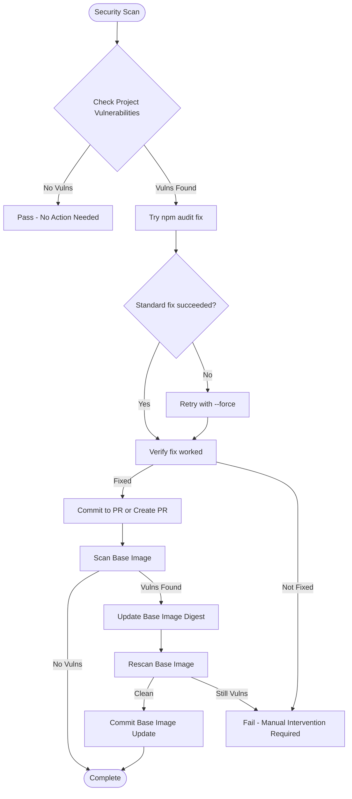

**Diagram sources**
- [.github/workflows/security.yml:81-166](file://.github/workflows/security.yml#L81-L166)
- [.github/workflows/security.yml:168-279](file://.github/workflows/security.yml#L168-L279)

**Section sources**
- [.github/workflows/security.yml:81-166](file://.github/workflows/security.yml#L81-L166)
- [.github/workflows/security.yml:168-279](file://.github/workflows/security.yml#L168-L279)

### Dockerfile Security Patches
**Updated** The Dockerfile now includes comprehensive security patches for vulnerable packages that are bundled with npm.

- **Proactive Vulnerability Patching**: Directly patches vulnerable packages (brace-expansion, undici, ip-address) within npm's installation directory
- **CVE Coverage**: Addresses multiple critical CVEs including CVE-2026-14257, CVE-2026-69152, CVE-2026-102276, CVE-2026-102278, CVE-2026-69192, and CVE-2026-19534
- **Layer Optimization**: Uses efficient tar extraction and cleanup to minimize image size impact
- **Future-Proofing**: Comments explain why patches are needed until npm bundles the fixed versions
- **Package Overrides**: Maintains overrides for minimatch, tar, typescript, brace-expansion, and undici in production builds

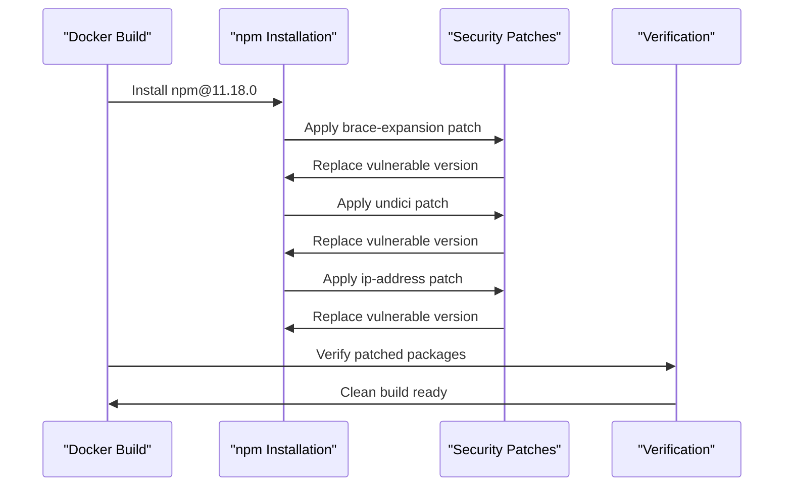

**Diagram sources**
- [Dockerfile:19-46](file://Dockerfile#L19-L46)
- [Dockerfile:58-68](file://Dockerfile#L58-L68)

**Section sources**
- [Dockerfile:19-46](file://Dockerfile#L19-L46)
- [Dockerfile:58-68](file://Dockerfile#L58-L68)

### Enhanced Automation Health Monitoring
**Updated** The automation health workflow monitors the entire automation ecosystem for stale producers and incomplete releases with enhanced handling of skipped workflow runs.

- **Scheduled Monitoring**: Runs hourly at minute 7 to detect automation issues
- **Stale Producer Detection**: Identifies workflows that haven't run recently or are stuck
- **Incomplete Release Tracking**: Monitors draft releases that never completed their publication process
- **Incident Deduplication**: Prevents multiple incidents for the same issue
- **Cross-Workflow Monitoring**: Watches Integration, Security, Automation policy, Renovate, npm audit fix, and Release workflows
- **Enhanced Health Checks**: Treats skipped workflow runs as healthy states when automation legitimately finds nothing to do
- **Improved False Positive Reduction**: Skipped conclusions indicate successful automation that found no work needed
- **Strict Stale Workflow Detection**: Maintains rigorous timeout checks for truly stale workflows

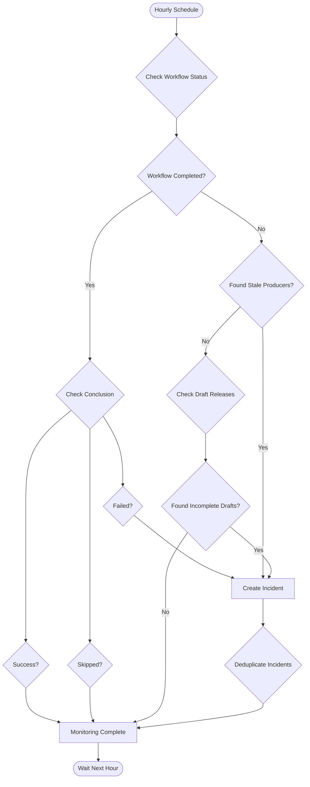

**Diagram sources**
- [.github/workflows/automation-health.yml](file://.github/workflows/automation-health.yml)
- [scripts/ci-health.mjs:17-19](file://scripts/ci-health.mjs#L17-L19)

**Section sources**
- [.github/workflows/automation-health.yml](file://.github/workflows/automation-health.yml)
- [scripts/ci-health.mjs:17-19](file://scripts/ci-health.mjs#L17-L19)

### Automation Policy Enforcement
**New** The automation policy workflow enforces consistent automation practices and validates configuration files.

- **Conventional Commit Validation**: Ensures PR titles follow conventional commit format
- **Deterministic Automation Testing**: Runs automation regression tests to ensure predictable behavior
- **Workflow Validation**: Validates GitHub Actions workflow syntax and best practices
- **Renovate Configuration Validation**: Ensures Renovate configuration follows project standards
- **Policy Enforcement**: Maintains consistency across all automation components

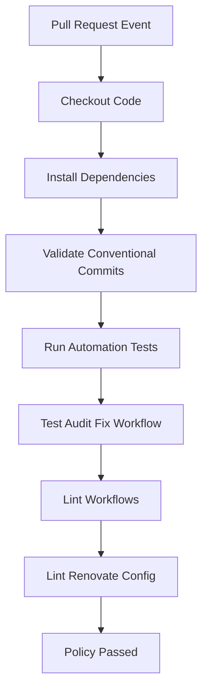

**Diagram sources**
- [.github/workflows/automation-policy.yml](file://.github/workflows/automation-policy.yml)

**Section sources**
- [.github/workflows/automation-policy.yml](file://.github/workflows/automation-policy.yml)

### Automated Security Maintenance with npm Audit Fix
**Updated** New daily automated security maintenance workflow that intelligently fixes dependency vulnerabilities and creates PRs with conventional commits.

- **Daily Scheduled Execution**: Runs at 6 AM UTC every day to detect and fix moderate-or-higher vulnerabilities
- **Intelligent Retry Logic**: Falls back to `npm audit fix --force` when standard fix cannot resolve dependency tree conflicts
- **Conventional Commits**: Creates `fix(deps):` commits that semantic-release versions as patch updates
- **Auto-Merge**: Automatically merges created PRs to maintain security posture
- **Deduplication**: Prevents multiple open audit-fix PRs simultaneously
- **Audit Logging**: Captures before/after audit logs for transparency
- **Build Verification**: Ensures fixed dependencies still build successfully

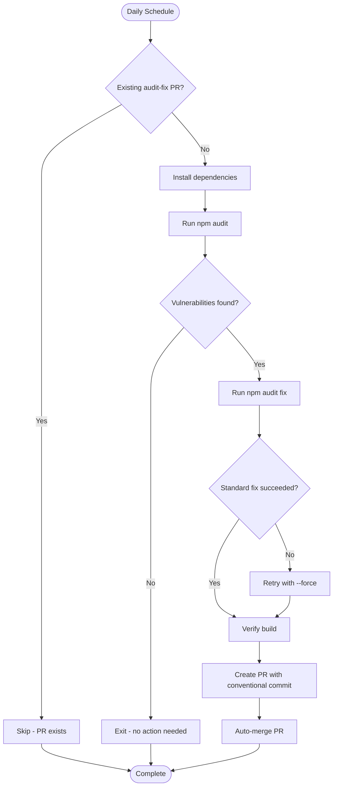

**Diagram sources**
- [.github/workflows/npm-audit-fix.yml](file://.github/workflows/npm-audit-fix.yml)
- [scripts/npm-audit-fix.sh](file://scripts/npm-audit-fix.sh)

**Section sources**
- [.github/workflows/npm-audit-fix.yml](file://.github/workflows/npm-audit-fix.yml)
- [scripts/npm-audit-fix.sh](file://scripts/npm-audit-fix.sh)

### Enhanced Parallel Test Execution Strategy
**Updated** The parallel test execution strategy now operates within the unified workflow with improved distribution logic and multi-version support.

- **Multi-Version Testing**: Tests run on Node 24 (primary) and Node 26 (advisory) for compatibility verification
- **Path Filtering**: Intelligent detection of relevant changes to skip unnecessary work for docs-only PRs
- **Phase-Aware Partitioning**: Read-only tests partitioned separately from write operations with fail-fast behavior
- **Enhanced Concurrency Control**: Improved worker allocation based on test type and resource requirements
- **Optimized Cache Sharing**: Better cache utilization between phases and workers including Playwright browser caching
- **Fail-Fast Integration**: Immediate failure propagation prevents unnecessary Phase 2 execution

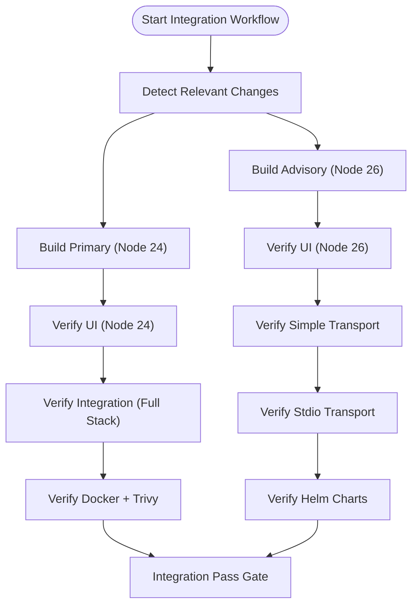

**Diagram sources**
- [.github/workflows/integration.yml](file://.github/workflows/integration.yml)
- [scripts/ci-parallel-checks.mjs](file://scripts/ci-parallel-checks.mjs)
- [tests/jest-sequencer.cjs](file://tests/jest-sequencer.cjs)
- [tests/reporters/jest-github-summary-reporter.cjs](file://tests/reporters/jest-github-summary-reporter.cjs)

**Section sources**
- [scripts/ci-parallel-checks.mjs](file://scripts/ci-parallel-checks.mjs)
- [.github/workflows/integration.yml](file://.github/workflows/integration.yml)
- [tests/jest-sequencer.cjs](file://tests/jest-sequencer.cjs)
- [tests/reporters/jest-github-summary-reporter.cjs](file://tests/reporters/jest-github-summary-reporter.cjs)

### Streamlined Build Configuration
**Updated** Build configuration has been optimized with removal of deprecated npm scripts and enhanced wiki synchronization capabilities.

- **Removed Deprecated Scripts**: Eliminated npm scripts referencing deleted sync-kairos-install-references.py script
- **Enhanced Wiki Synchronization**: Improved GitHub Actions workflow for automated wiki content updates with loop protection
- **Configuration Optimization**: Updated knip.config.ts and eslint/flat-config.cjs for better code analysis
- **Simplified Build Pipeline**: Reduced complexity while maintaining functionality
- **Package Version Sync**: Automated syncing of versions across package.json, compose.yaml, and Helm charts

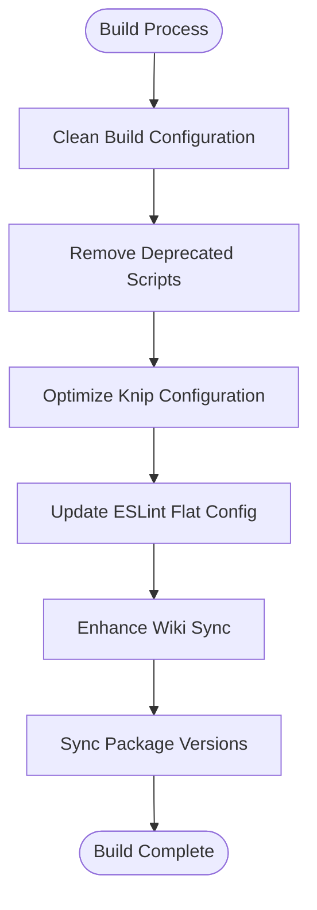

**Diagram sources**
- [package.json](file://package.json)
- [knip.config.ts](file://knip.config.ts)
- [eslint/flat-config.cjs](file://eslint/flat-config.cjs)
- [.github/workflows/integration.yml](file://.github/workflows/integration.yml)

**Section sources**
- [package.json](file://package.json)
- [knip.config.ts](file://knip.config.ts)
- [eslint/flat-config.cjs](file://eslint/flat-config.cjs)
- [.github/workflows/integration.yml](file://.github/workflows/integration.yml)

### Infrastructure Provisioning and Snapshots
- Wait-for-infra script ensures external services are ready before running integration tests.
- Snapshot import and seed scripts prepare deterministic datasets for reproducible tests.
- Environment creation helper sets up required variables and files.
- Docker image caching for infrastructure services reduces startup time.

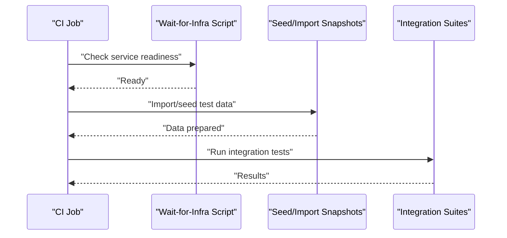

**Diagram sources**
- [scripts/ci-wait-for-infra.sh](file://scripts/ci-wait-for-infra.sh)
- [scripts/import-test-snapshot.sh](file://scripts/import-test-snapshot.sh)
- [scripts/seed-test-snapshot.sh](file://scripts/seed-test-snapshot.sh)
- [scripts/env/create-env.sh](file://scripts/env/create-env.sh)

**Section sources**
- [scripts/ci-wait-for-infra.sh](file://scripts/ci-wait-for-infra.sh)
- [scripts/import-test-snapshot.sh](file://scripts/import-test-snapshot.sh)
- [scripts/seed-test-snapshot.sh](file://scripts/seed-test-snapshot.sh)
- [scripts/env/create-env.sh](file://scripts/env/create-env.sh)

### Helm Chart Testing with Idempotent Publishing
**Updated** Helm chart testing now includes improved idempotent publishing support with better error handling for already-published versions.

- Dedicated script runs chart linting and validation with idempotent publishing
- Results are included in the CI summary
- Supports both standalone chart testing and full integration testing
- Enhanced error tolerance for existing chart versions during re-runs

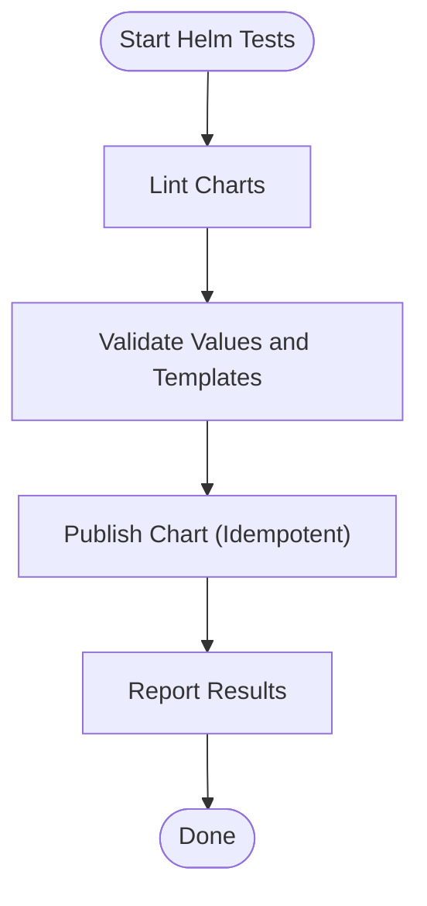

**Diagram sources**
- [scripts/test-helm.sh](file://scripts/test-helm.sh)
- [.github/workflows/release.yml:470-483](file://.github/workflows/release.yml#L470-L483)

**Section sources**
- [scripts/test-helm.sh](file://scripts/test-helm.sh)
- [.github/workflows/release.yml:470-483](file://.github/workflows/release.yml#L470-L483)

### Build Helpers and UI Environment
- UI environment definition script injects runtime variables during build.
- Embedded docs build script prepares documentation assets consumed at runtime.
- Autogenerated docs synchronization with loop protection.

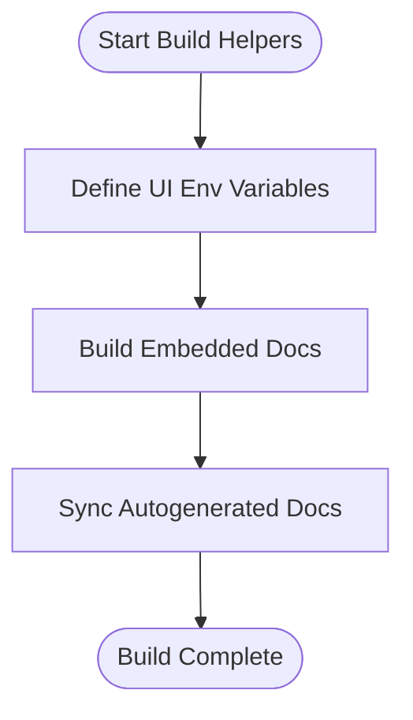

**Diagram sources**
- [scripts/build-vite-ui-env-define.ts](file://scripts/build-vite-ui-env-define.ts)
- [scripts/build-embed-docs.ts](file://scripts/build-embed-docs.ts)

**Section sources**
- [scripts/build-vite-ui-env-define.ts](file://scripts/build-vite-ui-env-define.ts)
- [scripts/build-embed-docs.ts](file://scripts/build-embed-docs.ts)

### Container Images and Entrypoints
- Multi-stage Dockerfiles for production, development, and stdio modes.
- Stdio entrypoint script configures runtime behavior for CLI usage.
- Migration from debian777/kairos-mcp to jakubplichcinski/kairos-mcp container registry.
- Keyless signing with cosign for container image provenance.

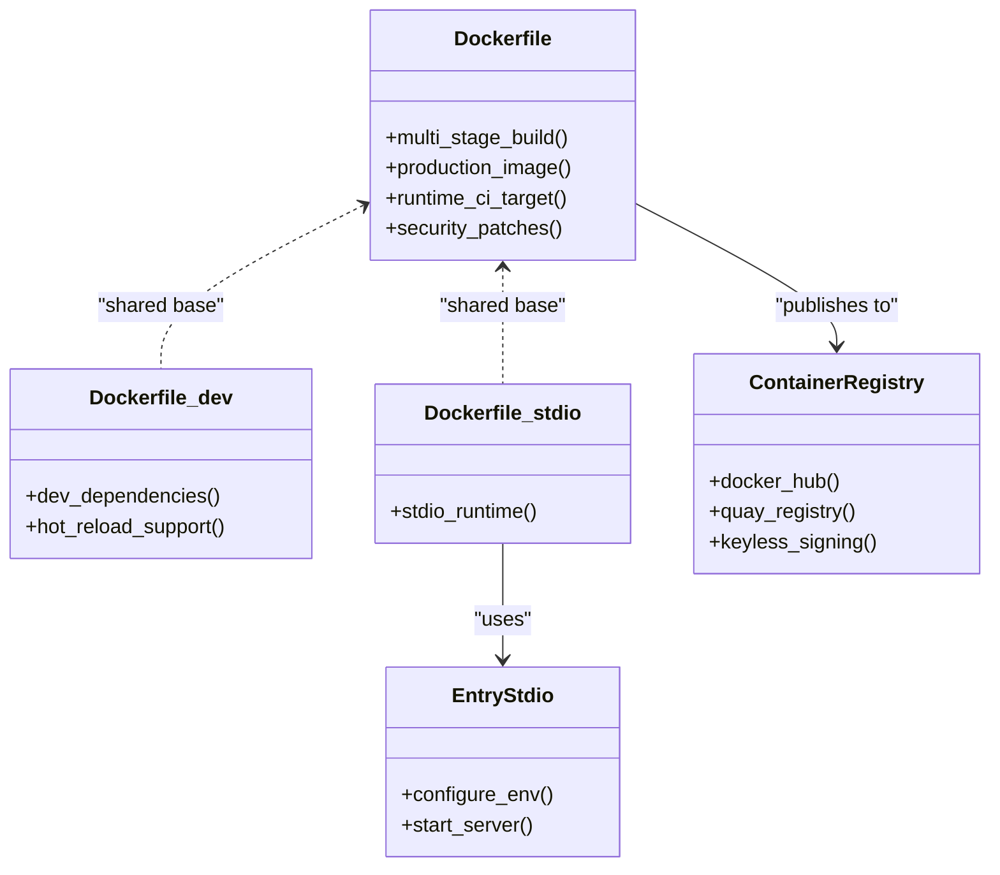

**Diagram sources**
- [Dockerfile](file://Dockerfile)
- [Dockerfile.dev](file://Dockerfile.dev)
- [Dockerfile.stdio](file://Dockerfile.stdio)
- [scripts/stdio/entrypoint.sh](file://scripts/stdio/entrypoint.sh)

**Section sources**
- [Dockerfile](file://Dockerfile)
- [Dockerfile.dev](file://Dockerfile.dev)
- [Dockerfile.stdio](file://Dockerfile.stdio)
- [scripts/stdio/entrypoint.sh](file://scripts/stdio/entrypoint.sh)

### Pre-commit Hooks and Local Development Automation
- Husky pre-commit hook enforces code quality and formatting before commits.
- Can be extended to include additional linters or tests.
- Integrated with CI pipeline for consistent quality gates.

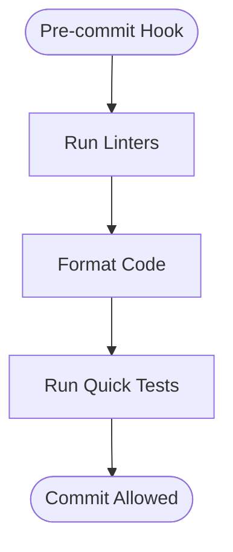

**Diagram sources**
- [.husky/pre-commit](file://.husky/pre-commit)

**Section sources**
- [.husky/pre-commit](file://.husky/pre-commit)

### Enhanced Security Scanning and Compliance Checks
**Updated** Security scanning has been enhanced with intelligent auto-remediation capabilities and updated CodeQL action references for improved vulnerability detection.

- Trivy scans containers and filesystems for vulnerabilities; ignores are managed via an ignore file with expiry tracking.
- **Enhanced CodeQL Analysis**: Uses github/codeql-action@v4.38.2 with enhanced security queries and improved JavaScript language support.
- Dependency review for pull requests.
- **Active npm Audit Integration**: Automated vulnerability detection with intelligent auto-remediation capabilities.
- **Base Image Vulnerability Remediation**: Automatic updates to container base images when vulnerabilities are detected.
- Results are published to the workflow summary.

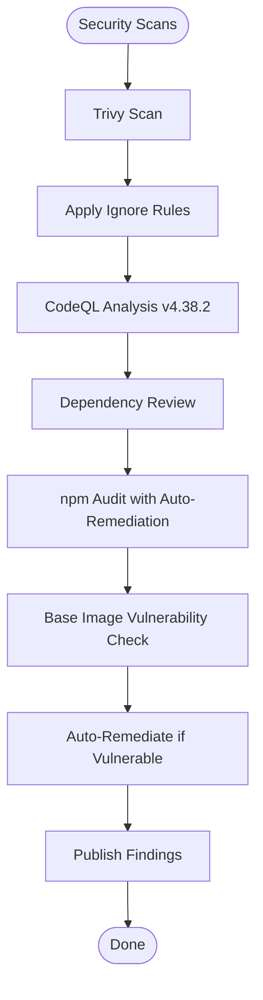

**Diagram sources**
- [.trivyignore](file://.trivyignore)
- [.github/workflows/security.yml](file://.github/workflows/security.yml)
- [.github/workflows/npm-audit-fix.yml](file://.github/workflows/npm-audit-fix.yml)

**Section sources**
- [.trivyignore](file://.trivyignore)
- [.github/workflows/security.yml](file://.github/workflows/security.yml)
- [.github/workflows/npm-audit-fix.yml](file://.github/workflows/npm-audit-fix.yml)

### Optimized Dependency Updates and Scheduling
**Updated** Dependency update workflows have been optimized with adjusted schedules for improved efficiency and reduced resource consumption.

- **Native GitHub Auto-Merge**: Leverages GitHub's built-in auto-merge functionality for Dependabot PRs instead of custom automation
- **Renovate Workflows**: Execute every 6 hours (at minute 17) for routine dependency updates without independent auto-merge
- **Dependabot Integration**: Native security updates with version-PR limit zero for enhanced security posture
- **AUTOMATION_ENABLED Control**: Both workflows respect the AUTOMATION_ENABLED variable for controlled rollout while maintaining independent operation
- **Enhanced Scheduling**: Optimized cron expressions reduce resource contention and improve overall CI/CD efficiency

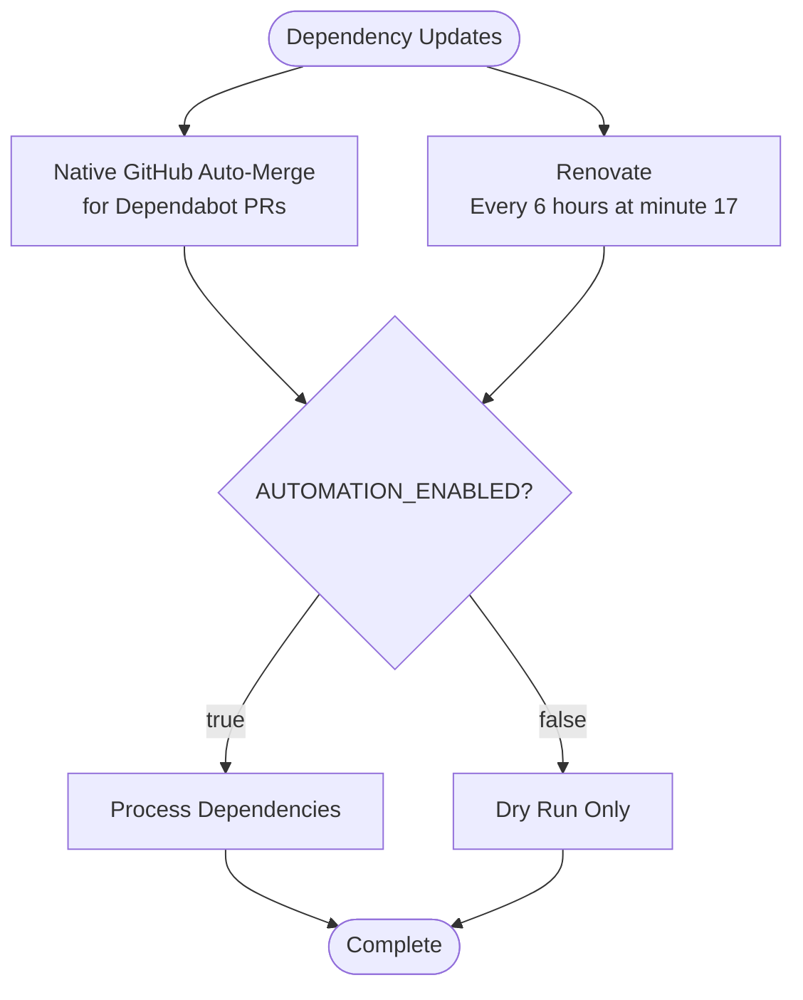

**Diagram sources**
- [.github/workflows/renovate.yml](file://.github/workflows/renovate.yml)
- [.github/dependabot.yml](file://.github/dependabot.yml)

**Section sources**
- [.github/workflows/renovate.yml](file://.github/workflows/renovate.yml)
- [.github/dependabot.yml](file://.github/dependabot.yml)

## Dependency Analysis
The CI workflow depends on:
- Node.js toolchain and package manager for installs and builds.
- Test runners configured via Jest and Vitest.
- External services provisioned by Compose or CI-hosted services.
- Helm CLI for chart validation.
- Security scanners (Trivy, CodeQL).
- Updated configuration tools (Knip, ESLint flat config).
- Semantic-release for automated versioning and publishing with branch-based release detection.
- OIDC provider for secure npm authentication.
- Container registries (Docker Hub, Quay) for image publishing.
- GitHub Actions artifacts for inter-job communication.
- Draft releases for state persistence and recovery.
- Enhanced health monitoring with skipped workflow handling.
- Independent release execution decoupled from AUTOMATION_ENABLED environment variable.
- Optimized scheduling for dependency update workflows.
- Robust npm metadata propagation polling with exponential backoff.
- Improved GitHub Release tag binding and orphaned release cleanup.
- **New**: Intelligent auto-remediation system for npm vulnerabilities and container base images.
- **New**: Native GitHub auto-merge for Dependabot PRs eliminating custom automation needs.

```mermaid
graph TB
PKG["package.json"]
JEST["jest.config.js"]
VITEST["vitest.config.ts"]
SEQ["tests/jest-sequencer.cjs"]
RPT["tests/reporters/jest-github-summary-reporter.cjs"]
COMPOSE["compose.yaml"]
HELM["scripts/test-helm.sh"]
TRIVY[".trivyignore"]
CODEQL[".github/workflows/security.yml"]
INTEGRATION[".github/workflows/integration.yml"]
RELEASE[".github/workflows/release.yml"]
SECURITY[".github/workflows/security.yml"]
AUDIT[".github/workflows/npm-audit-fix.yml"]
HEALTH[".github/workflows/automation-health.yml"]
POLICY[".github/workflows/automation-policy.yml"]
RENOVATE[".github/workflows/renovate.yml"]
DEPENDABOT[".github/dependabot.yml"]
KNIP["knip.config.ts"]
ESLINT["eslint/flat-config.cjs"]
SR["release.config.mjs"]
HELM_VER["scripts/helm-set-release-version.mjs"]
RELEASE_SCRIPT["scripts/ci-release.mjs"]
RELEASE_STATE["scripts/ci-release-state.mjs"]
HEALTH_SCRIPT["scripts/ci-health.mjs"]
AUTOMATION_LIB["scripts/ci-automation.mjs"]
DOCKERFILE["Dockerfile"]
PKG --> JEST
PKG --> VITEST
JEST --> SEQ
JEST --> RPT
COMPOSE --> JEST
HELM --> JEST
TRIVY --> CODEQL
INTEGRATION --> JEST
INTEGRATION --> RPT
RELEASE --> SECURITY
RELEASE --> AUDIT
RELEASE --> HEALTH
RELEASE --> POLICY
RELEASE --> SR
RELEASE --> HELM_VER
RELEASE --> RELEASE_SCRIPT
RELEASE --> RELEASE_STATE
HEALTH --> HEALTH_SCRIPT
HEALTH_SCRIPT --> AUTOMATION_LIB
KNIP --> INTEGRATION
ESLINT --> INTEGRATION
RENOVATE --> AUTOMATION_LIB
DEPENDABOT --> SECURITY
DOCKERFILE --> SECURITY
```

**Diagram sources**
- [package.json](file://package.json)
- [jest.config.js](file://jest.config.js)
- [vitest.config.ts](file://vitest.config.ts)
- [tests/jest-sequencer.cjs](file://tests/jest-sequencer.cjs)
- [tests/reporters/jest-github-summary-reporter.cjs](file://tests/reporters/jest-github-summary-reporter.cjs)
- [compose.yaml](file://compose.yaml)
- [scripts/test-helm.sh](file://scripts/test-helm.sh)
- [.trivyignore](file://.trivyignore)
- [.github/workflows/security.yml](file://.github/workflows/security.yml)
- [.github/workflows/integration.yml](file://.github/workflows/integration.yml)
- [.github/workflows/release.yml](file://.github/workflows/release.yml)
- [.github/workflows/npm-audit-fix.yml](file://.github/workflows/npm-audit-fix.yml)
- [.github/workflows/automation-health.yml](file://.github/workflows/automation-health.yml)
- [.github/workflows/automation-policy.yml](file://.github/workflows/automation-policy.yml)
- [.github/workflows/renovate.yml](file://.github/workflows/renovate.yml)
- [.github/dependabot.yml](file://.github/dependabot.yml)
- [knip.config.ts](file://knip.config.ts)
- [eslint/flat-config.cjs](file://eslint/flat-config.cjs)
- [release.config.mjs](file://release.config.mjs)
- [scripts/helm-set-release-version.mjs](file://scripts/helm-set-release-version.mjs)
- [scripts/ci-release.mjs](file://scripts/ci-release.mjs)
- [scripts/ci-release-state.mjs](file://scripts/ci-release-state.mjs)
- [scripts/ci-health.mjs](file://scripts/ci-health.mjs)
- [scripts/ci-automation.mjs](file://scripts/ci-automation.mjs)
- [Dockerfile](file://Dockerfile)

**Section sources**
- [package.json](file://package.json)
- [jest.config.js](file://jest.config.js)
- [vitest.config.ts](file://vitest.config.ts)
- [tests/jest-sequencer.cjs](file://tests/jest-sequencer.cjs)
- [tests/reporters/jest-github-summary-reporter.cjs](file://tests/reporters/jest-github-summary-reporter.cjs)
- [compose.yaml](file://compose.yaml)
- [scripts/test-helm.sh](file://scripts/test-helm.sh)
- [.trivyignore](file://.trivyignore)
- [.github/workflows/security.yml](file://.github/workflows/security.yml)
- [.github/workflows/integration.yml](file://.github/workflows/integration.yml)
- [.github/workflows/release.yml](file://.github/workflows/release.yml)
- [.github/workflows/npm-audit-fix.yml](file://.github/workflows/npm-audit-fix.yml)
- [.github/workflows/automation-health.yml](file://.github/workflows/automation-health.yml)
- [.github/workflows/automation-policy.yml](file://.github/workflows/automation-policy.yml)
- [.github/workflows/renovate.yml](file://.github/workflows/renovate.yml)
- [.github/dependabot.yml](file://.github/dependabot.yml)
- [knip.config.ts](file://knip.config.ts)
- [eslint/flat-config.cjs](file://eslint/flat-config.cjs)
- [release.config.mjs](file://release.config.mjs)
- [scripts/helm-set-release-version.mjs](file://scripts/helm-set-release-version.mjs)
- [scripts/ci-release.mjs](file://scripts/ci-release.mjs)
- [scripts/ci-release-state.mjs](file://scripts/ci-release-state.mjs)
- [scripts/ci-health.mjs](file://scripts/ci-health.mjs)
- [scripts/ci-automation.mjs](file://scripts/ci-automation.mjs)
- [Dockerfile](file://Dockerfile)

## Performance Considerations
**Updated** Performance optimizations have been enhanced through workflow consolidation, multi-version testing strategy, streamlined build configuration, automated security maintenance, improved idempotent publishing, the new modular release architecture, enhanced health monitoring with reduced false positives, and optimized dependency update scheduling. **Enhanced** The security workflow now features intelligent auto-remediation capabilities that proactively fix vulnerabilities without manual intervention.

- **Caching**:
  - Restore and save Node modules and build caches between jobs to minimize install times.
  - Cache test snapshots where appropriate to speed up integration tests.
  - Optimized cache sharing between primary and advisory test runs.
  - Playwright browser caching for UI tests across different Node versions.
  - Docker infrastructure image caching for faster test startup.
  - GitHub Actions artifact caching for release artifacts.
- **Parallelization**:
  - Use matrix strategies to split suites across workers.
  - Leverage the parallel checks script to distribute workloads efficiently.
  - Multi-version testing (Node 24 + Node 26) runs in parallel.
  - Path-based filtering skips unnecessary work for docs-only changes.
  - Concurrent infrastructure setup and dependency installation.
  - Modular release jobs run independently with artifact-based communication.
- **Artifact reuse**:
  - Upload build artifacts once and consume them in subsequent jobs to avoid redundant builds.
  - Consolidated artifact management reduces upload/download overhead.
  - Shared npm package artifacts across integration test variants.
  - Immutable release artifacts stored in GitHub Actions storage for recovery.
- **Concurrency limits**:
  - Configure runner concurrency to prevent resource contention.
  - Release pipeline serialization prevents concurrent version conflicts.
  - Audit fix workflow deduplication prevents duplicate PRs.
  - Draft release locking prevents concurrent modifications.
- **Image optimization**:
  - Use multi-stage Dockerfiles to keep images lean and reduce scan times.
  - Single build-push operation for multiple registries reduces build time.
  - Keyless signing eliminates separate signing step overhead.
- **Two-Phase Optimization**:
  - Fail-fast behavior eliminates unnecessary Phase 2 execution when Phase 1 fails.
  - Read-only tests execute faster, providing quicker feedback.
  - Reduced overall workflow duration through intelligent test ordering.
- **Build Configuration Optimization**:
  - Removed deprecated npm scripts reduce build complexity and improve performance.
  - Enhanced wiki synchronization minimizes overhead in CI pipelines.
  - Optimized Knip and ESLint configurations provide faster analysis.
- **Automated Security Maintenance**:
  - Daily npm audit fix workflow maintains security posture without manual intervention.
  - Intelligent retry logic handles complex dependency resolution scenarios.
  - Auto-merge policy keeps dependencies current with minimal overhead.
- **Idempotent Publishing**:
  - Improved Helm publishing with better error tolerance for already-published versions.
  - Simplified release workflow reduces computational overhead.
  - Branch-based release detection eliminates manual input processing.
  - Modular release architecture improves fault tolerance and recovery.
- **Enhanced Health Monitoring Performance**:
  - Skipped workflow handling reduces false positive alerts and unnecessary incident creation.
  - Improved health check logic processes workflow conclusions more efficiently.
  - Better incident deduplication reduces API calls and processing overhead.
- **Optimized Dependency Update Scheduling**:
  - Native GitHub auto-merge eliminates custom automation overhead for Dependabot PRs.
  - Renovate workflows execute every 6 hours to balance update frequency with resource usage.
  - Independent execution model allows dependency updates to continue even when AUTOMATION_ENABLED is disabled.
- **Enhanced Security Workflow Performance**:
  - Intelligent auto-remediation eliminates manual intervention overhead.
  - Context-aware PR handling reduces unnecessary API calls.
  - Verification loops ensure remediation effectiveness without excessive retries.
  - Base image updates are optimized to minimize rebuild overhead.

## Troubleshooting Guide
**Updated** Enhanced troubleshooting guidance for the consolidated workflow, multi-version testing strategy, streamlined build configuration, automated security maintenance, improved idempotent publishing, the new modular release architecture, enhanced health monitoring with skipped workflow handling, and optimized dependency update scheduling. **Enhanced** Includes guidance for the enhanced security workflow with intelligent auto-remediation capabilities.

- **Debugging CI failures**:
  - Inspect step summaries generated by the summary script for aggregated results.
  - Download artifacts containing logs and reports for deeper analysis.
  - Use wait-for-infra logs to verify external service readiness.
  - Check Phase 1 vs Phase 2 failure indicators in workflow output.
  - Review consolidated workflow logs instead of separate integration workflow logs.
  - Verify build configuration changes don't break existing workflows.
  - Check automation health workflow for stale producer detection with enhanced skipped handling.
  - Review draft releases for incomplete release recovery.
  - **New**: Investigate auto-remediation failures in the security workflow for npm vulnerabilities and base image updates.
  - **New**: Check if native GitHub auto-merge is properly configured for Dependabot PRs.
  - **New**: Verify Dockerfile security patches are applied correctly during builds.
- **Common issues**:
  - Missing environment variables: Ensure create-env and deploy-run-env scripts are executed in the correct order.
  - Snapshot mismatches: Re-seed or import snapshots if test data drift occurs.
  - Helm validation errors: Review values and templates referenced by the Helm test script.
  - Security findings: Adjust .trivyignore only when justified; otherwise remediate vulnerabilities.
  - Phase 1 failures preventing Phase 2 execution - verify read-only test dependencies.
  - Resource contention in unified workflow - adjust matrix configuration if needed.
  - Build configuration issues - check for removed npm scripts and updated configuration files.
  - **New**: Auto-remediation failures - check npm audit fix permissions and GitHub token configuration.
  - **New**: Base image update failures - verify Docker Hub access and digest resolution.
  - **New**: Dependabot PR auto-merge issues - check repository settings and branch protection rules.
  - **New**: Dockerfile patch application failures - verify npm pack commands and tar extraction permissions.
  - **New**: Security workflow permission errors - ensure proper GITHUB_TOKEN and GH_PAT configuration.
  - **New**: Vulnerability detection false positives - review npm audit filtering logic for bundled dependencies.
- **Optimization tips**:
  - Increase cache keys specificity to avoid stale caches.
  - Reduce suite size or shard further if tests exceed timeouts.
  - Pin Node.js versions to ensure consistent builds.
  - Optimize test partitioning between phases for balanced execution time.
  - Monitor Phase 1 completion time to identify slow read-only tests.
  - Leverage streamlined build configuration for faster CI execution.
  - Utilize path filtering to skip unnecessary work for documentation changes.
  - Monitor npm audit fix workflow effectiveness and adjust thresholds as needed.
  - **New**: Tune auto-remediation aggressiveness based on vulnerability severity and business impact.
  - **New**: Monitor base image update frequency to balance security with stability.
  - **New**: Leverage native GitHub auto-merge to reduce custom automation overhead.
  - **New**: Optimize Dockerfile security patches to minimize build time impact.

**Section sources**
- [scripts/ci-github-step-summary.mjs](file://scripts/ci-github-step-summary.mjs)
- [scripts/ci-wait-for-infra.sh](file://scripts/ci-wait-for-infra.sh)
- [scripts/env/create-env.sh](file://scripts/env/create-env.sh)
- [scripts/deploy-run-env.sh](file://scripts/deploy-run-env.sh)
- [scripts/import-test-snapshot.sh](file://scripts/import-test-snapshot.sh)
- [scripts/seed-test-snapshot.sh](file://scripts/seed-test-snapshot.sh)
- [scripts/test-helm.sh](file://scripts/test-helm.sh)
- [.trivyignore](file://.trivyignore)
- [.github/workflows/integration.yml](file://.github/workflows/integration.yml)
- [.github/workflows/release.yml](file://.github/workflows/release.yml)
- [.github/workflows/npm-audit-fix.yml](file://.github/workflows/npm-audit-fix.yml)
- [.github/workflows/automation-health.yml](file://.github/workflows/automation-health.yml)
- [.github/workflows/automation-policy.yml](file://.github/workflows/automation-policy.yml)
- [.github/workflows/renovate.yml](file://.github/workflows/renovate.yml)
- [scripts/ci-health.mjs](file://scripts/ci-health.mjs)
- [scripts/ci-release.mjs](file://scripts/ci-release.mjs)
- [scripts/ci-release-state.mjs](file://scripts/ci-release-state.mjs)
- [knip.config.ts](file://knip.config.ts)
- [eslint/flat-config.cjs](file://eslint/flat-config.cjs)
- [.github/workflows/security.yml](file://.github/workflows/security.yml)
- [Dockerfile](file://Dockerfile)

## Conclusion
Kairos MCP's CI system has undergone a complete redesign featuring semantic-release integration with branch-based release type detection, unified release pipeline, automated security maintenance, Copilot-powered CI failure auto-fix, OIDC trusted publishing for npm packages, and container registry migration to jakubplichcinski/kairos-mcp. The new architecture provides a single manual dispatch that publishes npm packages, container images (Docker Hub + Quay), Helm charts, git tags, and GitHub Releases from one SemVer version computed by semantic-release, with release types automatically derived from branch context instead of requiring explicit operator configuration.

**Updated** The security workflow has been transformed from passive scanning to an active remediation system with intelligent auto-remediation for npm vulnerabilities and container base image issues. The automerge-dependabot.yml and ci-failure-auto-fix.yml workflows have been removed as native GitHub auto-merge now handles Dependabot PRs and the Copilot-based CI failure auto-fix was removed due to duplicate PR bugs. The Dockerfile includes comprehensive security patches for vulnerable packages including brace-expansion, undici, and ip-address addressing multiple CVEs. These improvements deliver faster feedback loops, improved resource utilization, simplified maintenance, reduced build complexity, enhanced security, automated dependency management, improved idempotent publishing, and enhanced reliability through modular architecture while maintaining comprehensive test coverage across multiple Node.js versions. The modular scripts and clear separation of concerns make it straightforward to extend pipelines, add new checks, and optimize performance. Adopting the recommended practices will help maintain high-quality releases and secure deployments with enhanced efficiency, reliability, and observability.

## Appendices

### Example Custom CI Scripts and Tasks
- **Enhanced modular release pipeline with artifact communication**: Orchestrates semantic-release with automatic release type derivation, separated into resolve, prepare, and publish jobs communicating through GitHub Actions artifacts and draft releases with OIDC authentication. Features improved GitHub Release tag binding, direct npm channel-tagged publishing, robust metadata propagation polling with exponential backoff, orphaned release cleanup, and updated workflow permissions.
- **Enhanced automation health monitoring**: Hourly monitoring of stale producers and incomplete releases with incident deduplication and improved skipped workflow handling that treats skipped conclusions as healthy states.
- **Automation policy enforcement**: Validates conventional commits, workflow configurations, and automation regressions.
- **Automated security maintenance**: Daily npm audit fix workflow with intelligent retry logic and conventional commits.
- **Enhanced security workflow with intelligent auto-remediation**: Active remediation system that automatically fixes npm vulnerabilities and updates container base images, transforming from passive scanning to proactive security maintenance.
- **Multi-version testing**: Parallel execution on Node 24 (primary) and Node 26 (advisory) for compatibility verification.
- **Path-based filtering**: Intelligent detection of relevant changes to skip unnecessary work for docs-only PRs.
- **Parallel checks**: Distribute test suites across workers for faster execution with phase-aware distribution.
- **Step summary**: Aggregate results into a single GitHub summary for visibility.
- **TGZ install test**: Validate packaged artifacts installation flows.
- **Infra wait**: Poll external services until healthy before running dependent tests.
- **Helm tests with idempotent publishing**: Lint and validate charts consistently across environments with improved error tolerance.
- **Snapshot management**: Import and seed deterministic datasets for stable tests.
- **Build helpers**: Define UI env variables and build embedded docs for runtime consumption.
- **Deploy environment**: Prepare runtime environment variables and secrets for deployment jobs.
- **Stdio entrypoint**: Configure CLI runtime behavior for headless operations.
- **Streamlined build configuration**: Optimized npm scripts with enhanced wiki synchronization.
- **Configuration management**: Updated Knip and ESLint configurations for improved code analysis.
- **Container registry migration**: Updated from debian777/kairos-mcp to jakubplichcinski/kairos-mcp with multi-registry support.
- **Optimized dependency update scheduling**: Native GitHub auto-merge for Dependabot PRs, renovate workflows execute every 6 hours with independent operation from AUTOMATION_ENABLED.
- **Enhanced security scanning**: Updated CodeQL action references (v4.38.2) for improved vulnerability detection and JavaScript language support.
- **Dockerfile security patches**: Comprehensive vulnerability patches for brace-expansion, undici, and ip-address addressing multiple CVEs.
- **Robust npm metadata propagation**: Exponential backoff polling with up to 30 attempts for npm registry metadata availability.
- **Orphaned release cleanup**: Automatic deletion of unrecoverable 'untagged-*' drafts left by interrupted runs.
- **Improved GitHub Release tag binding**: Every PATCH operation maintains tag_name association with final verification.

**Section sources**
- [.github/workflows/release.yml](file://.github/workflows/release.yml)
- [.github/workflows/npm-audit-fix.yml](file://.github/workflows/npm-audit-fix.yml)
- [.github/workflows/integration.yml](file://.github/workflows/integration.yml)
- [.github/workflows/automation-health.yml](file://.github/workflows/automation-health.yml)
- [.github/workflows/automation-policy.yml](file://.github/workflows/automation-policy.yml)
- [.github/workflows/renovate.yml](file://.github/workflows/renovate.yml)
- [scripts/ci-parallel-checks.mjs](file://scripts/ci-parallel-checks.mjs)
- [scripts/ci-github-step-summary.mjs](file://scripts/ci-github-step-summary.mjs)
- [scripts/ci-test-tgz-install.mjs](file://scripts/ci-test-tgz-install.mjs)
- [scripts/ci-wait-for-infra.sh](file://scripts/ci-wait-for-infra.sh)
- [scripts/test-helm.sh](file://scripts/test-helm.sh)
- [scripts/import-test-snapshot.sh](file://scripts/import-test-snapshot.sh)
- [scripts/seed-test-snapshot.sh](file://scripts/seed-test-snapshot.sh)
- [scripts/build-vite-ui-env-define.ts](file://scripts/build-vite-ui-env-define.ts)
- [scripts/build-embed-docs.ts](file://scripts/build-embed-docs.ts)
- [scripts/deploy-run-env.sh](file://scripts/deploy-run-env.sh)
- [scripts/stdio/entrypoint.sh](file://scripts/stdio/entrypoint.sh)
- [scripts/npm-audit-fix.sh](file://scripts/npm-audit-fix.sh)
- [scripts/helm-set-release-version.mjs](file://scripts/helm-set-release-version.mjs)
- [scripts/ci-release.mjs](file://scripts/ci-release.mjs)
- [scripts/ci-release-state.mjs](file://scripts/ci-release-state.mjs)
- [scripts/ci-health.mjs](file://scripts/ci-health.mjs)
- [scripts/ci-automation.mjs](file://scripts/ci-automation.mjs)
- [release.config.mjs](file://release.config.mjs)
- [knip.config.ts](file://knip.config.ts)
- [eslint/flat-config.cjs](file://eslint/flat-config.cjs)
- [.github/workflows/security.yml](file://.github/workflows/security.yml)
- [Dockerfile](file://Dockerfile)