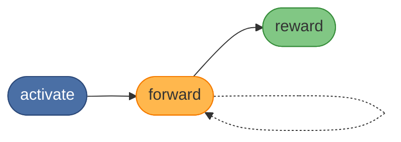
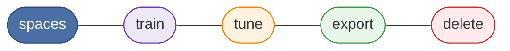

# SquadRules MCP

<!-- squadrules-lint-allow-protocol-synonyms -->


[](https://opensource.org/licenses/MIT)
[](https://nodejs.org/)

SquadRules is an agent-facing persistent protocol system that bridges generic
model competence and your actual local procedure. Even an agent that already
knows Git must consult your local rules before acting on "Create PR." MCP is
one interface into SquadRules, not the whole identity.

SquadRules MCP is a TypeScript service for storing and executing reusable
protocol chains for AI agents. It exposes:

- an MCP endpoint at `POST /mcp`
- REST endpoints under `/api/*`
- a browser UI under `/ui`
- a CLI named `squadrules`

Without persistent workflows, agents repeat work, lose context, and cannot
follow multi-step procedures reliably. SquadRules fixes this with three core
ideas (the diagrams below list every **MCP tool**):

- **Persistent memory** — store and retrieve protocol chains across sessions
- **Deterministic execution** — **activate** → **forward** (per layer) →
  **reward**; the server drives `next_action` at every step
- **Agent-facing design** — tool descriptions and error messages built for
  programmatic consumption and recovery

Protocol execution runs in a fixed order: **activate** (match adapters),
**forward** (run each layer’s contract; loop), then **reward** (finalize the
run). Use **train** / **tune** / **export** / **delete** / **spaces** as
described in each tool’s MCP description.

**Default run order** — `activate` → `forward` (loop per layer) → `reward`:



**Discovery and adapter lifecycle** — no fixed order; follow each tool’s MCP description:



The server generates challenge data (`nonce`, `proof_hash`, URIs); agents echo
those values back exactly.

## Protocol execution

Authoritative behavior for agents is defined in the MCP tool resources under
[`src/embed-docs/tools/`](src/embed-docs/tools/) (**`activate`**, **`forward`**,
**`reward`**). This is an on-wire summary; follow each response’s `next_action`
and `must_obey` fields in real runs.

1. **`activate`** — Provide a short `query` string (about 3-8 words) on every
   call. From `choices`, pick **one** row and obey **that** row’s `next_action`
   (do not mix in another URI). Typical roles: **`match`** (continue with
   **`forward`** on the given adapter URI), **`refine`**, **`create`**
   (register a new adapter with **`train`**).

2. **`forward`** — With the adapter URI from **`activate`**, call **`forward`**
   and **omit** `solution` on the **first** call for that run. Read `contract`
   and `next_action`. For each layer, call **`forward`** again using the **layer**
   URI from the last response (add `?execution_id=...` when the server returns
   it) and supply a `solution` whose `type` matches `contract.type`. Loop until
   `next_action` tells you to call **`reward`**.

3. **`reward`** — After the last layer, call **`reward`** with the **layer** URI
   from **`forward`** (not the adapter URI unless the schema explicitly allows
   it), `outcome` (`success` or `failure`), and optional evaluator fields per the
   tool description.

**Must always:** Obey `next_action` verbatim. Echo server-issued `nonce`,
`proof_hash`, and URIs exactly.

**Must never:** Invent URIs; skip layers; submit a solution whose type does not
match `contract.type`.

For a longer narrative, see the **Workflow Engine** pages in the
[SquadRules wiki](https://github.com/SquadRules/mcp/wiki).

## What runs in this repository

The current codebase includes:

- **HTTP application server** — Express app for MCP, REST, auth routes, and UI
- **stdio MCP transport** — direct local-host launch path for desktop/IDE MCP clients
- **Vector/trace store** — embedded LanceDB by default; Qdrant when `QDRANT_URL` is set
- **Optional Redis cache / proof-of-work state store** — enabled when `REDIS_URL` is set
- **Optional Keycloak auth integration** — browser session + Bearer JWT validation
- **React UI** — served from the same origin at `/ui`
- **CLI** — talks to the HTTP API

## Transport modes

Use one transport mode per process:

**`squadrules serve` / `squadrules-mcp serve`** (run the MCP server from the npm package):

- **`--transport stdio|http`** overrides **`TRANSPORT_TYPE`** for that process only.
- If neither is set, **`serve` defaults to stdio** (good for local MCP hosts).
- Other **`squadrules`** commands (login, train, …) do not use `--transport`; they only see
  **`TRANSPORT_TYPE`** if you set it in the environment (normally leave it unset for CLI-only use).

- **`TRANSPORT_TYPE=http`**: serves `/mcp`, `/api/*`, `/ui`, and `/health`; this is
  the default for Docker Compose deployments.
- **`TRANSPORT_TYPE=stdio`**: runs MCP over stdin/stdout for local hosts such as
  Claude Desktop, Cursor, or Claude Code. In this mode, stdout is reserved for
  MCP protocol frames and logs go to stderr.

## Quick start

SquadRules runs as a local MCP server that your agent host launches over **stdio**
(the default transport). You do not need to clone this repo or run Docker
Compose — install the package globally and point your host at `squadrules serve`.

### Prerequisites

- **Node.js 24+**.
- **One embedding backend**, supplied through the host `env` below (the embedded
  store removes the vector *database* dependency, not the embedding provider).
- **No database required.** By default SquadRules keeps its vectors in an embedded,
  file-backed LanceDB store under `~/.config/squadrules/lancedb` (created on first
  run) — no Qdrant, Redis, or Docker. To keep an existing Qdrant, set `QDRANT_URL`;
  the single-switch selection rule and limitations live in
  [Known issues & limitations](docs/known-issues-and-limitations.md#vector-store-backends).

### Install

```bash
npm install -g @squadrules/mcp
squadrules --help
```

The global install provides both the **`squadrules`** CLI (bulk operations, auth,
server management) and the MCP server binary used by your agent host. The
package also installs **`squadrules-mcp`** and retains the former **`squadrules`**
and **`squadrules-mcp`** command names as compatibility aliases.

### Configure your MCP host

Add SquadRules to your host's `mcp.json` (Cursor, Claude Desktop, Claude Code, …).
`serve` uses **stdio** by default, so **no `--transport` flag is needed**:

```json
{
  "mcpServers": {
    "SquadRules": {
      "command": "squadrules",
      "args": ["serve"],
      "env": {}
    }
  }
}
```

An empty `env` is enough: with no `QDRANT_URL` the server uses the embedded
LanceDB store (created on first run under `~/.config/squadrules/lancedb`), and
embeddings run **locally with fastembed** (no API key, no inference service; the
model is downloaded once into `~/.config/squadrules/models`). To use an existing
Qdrant instead, add `"QDRANT_URL": "http://localhost:6333"` (and
`"QDRANT_API_KEY": ""` for no-auth localhost Qdrant). To override the local
embedding default with an external backend, supply **one** of:

- **OpenAI** — `OPENAI_API_KEY`
- **Ollama / OpenAI-compatible** — `OPENAI_API_URL`, `OPENAI_EMBEDDING_MODEL`,
  and `OPENAI_API_KEY=ollama`
- **TEI** (deprecated) — `TEI_BASE_URL` (+ optional `TEI_MODEL`)

Every parameter is **ENV-overridable**. To run SquadRules as an HTTP listener
instead of stdio, add `"--transport", "http"` to `args` (see
[Transport modes](#transport-modes)).

Some hosts show a longer **agent-visible** server id (for example one ending in
`-SQUADRULES`); see [AGENTS.md](AGENTS.md) for the runtime authority note.

When executing over MCP, follow **[Protocol execution](#protocol-execution)**
above and each tool result's `next_action`. The connected server's tool
descriptions are the runtime authority if they differ from this file.

> **Developers:** to run the full Docker Compose stack (Qdrant + app + optional
> Keycloak / Redis / Postgres) for local development and testing, see
> [CONTRIBUTING.md](CONTRIBUTING.md).

## CLI

The `squadrules` CLI is installed as part of the global package (see
[Install](#install) above). It provides bulk adapter operations, authentication,
export/import, and server management — the same binary your MCP host uses for
`squadrules serve`.

```bash
squadrules --help
```

See [docs/CLI.md](docs/CLI.md).

## Add SquadRules to your agent instructions

This repo ships the **squadrules** skill for running protocols. Use `--list`
to see what the skills registry reports for this repo.

If you want agents to use SquadRules consistently, add a short repo rule or
instruction such as:

> SquadRules MCP is a Model Context Protocol server for persistent memory and
> deterministic adapter execution. Execute protocols in this order:
> **`activate`** → **`forward`** (loop per layer until `next_action` points to
> **`reward`**) → **`reward`**. Echo all server-generated hashes, nonces, and
> URIs exactly.

## Agent skills shipped in this repo

This repository ships its agent skills under
[`.agents/skills/`](.agents/skills/). Two skills are published:

| Skill | Audience | Purpose |
|-------|----------|---------|
| `squadrules` | Users | Run SquadRules protocols; install and update guidance; bug reports |
| `squadrules-dev` | Developers | Docker Compose dev environment and maintainer workflows (internal; not installed by `npx skills add`) |

The former `squadrules` and `squadrules-dev` skill directories are retained for
compatibility with existing installations; hosts prefer `squadrules` when both
are present.

Install the user skill:

```bash
npx skills add SquadRules/mcp --skill squadrules
```

List available skills:

```bash
npx skills add SquadRules/mcp --list
```

Popular global installs:

| Agents | Command |
|--------|---------|
| Cursor | `npx skills add SquadRules/mcp --skill squadrules -y -g -a cursor` |
| Claude Code | `npx skills add SquadRules/mcp --skill squadrules -y -g -a claude-code` |
| Cursor + Claude Code | `npx skills add SquadRules/mcp --skill squadrules -y -g -a cursor -a claude-code` |

More detail: [.agents/skills/README.md](.agents/skills/README.md)

## Helm (advanced)

The Helm chart for Kubernetes deployment now lives in the
[`SquadRules/charts`](https://github.com/SquadRules/charts) repository and is
published to `oci://ghcr.io/squadrules/charts/mcp`. See that repository for
installation, values, and chart-testing details.

## Container images

Container images are built, scanned, signed and published from the
[`SquadRules/containers`](https://github.com/SquadRules/containers) repository,
FROM the published `@squadrules/mcp` npm package, to Docker Hub
(`docker.io/squadrules/mcp`) and quay.io. This repository publishes npm only;
see that repository for the image pipeline, base-image OS scanning and signing.

## Documentation map

- [Documentation index](docs/README.md)
- [Install and environment](docs/install/README.md)
- [Cursor and MCP](docs/install/README.md#cursor-and-mcp)
- [CLI reference](docs/CLI.md)
- [Architecture (SquadRules wiki)](https://github.com/SquadRules/mcp/wiki)
- [Adapter examples](docs/examples/README.md)
- [Contributing](CONTRIBUTING.md)

## Troubleshooting

### The server does not start

In stdio mode SquadRules logs to **stderr** (stdout is reserved for MCP frames).
Check your host's MCP log panel for the `SquadRules` server. The most common cause
is Qdrant not being reachable.

### SquadRules cannot reach Qdrant

SquadRules requires a Qdrant instance and only becomes healthy once Qdrant is
ready. Confirm one is listening on your `QDRANT_URL` (default
`http://localhost:6333`):

```bash
curl http://localhost:6333/readyz
```

If you run SquadRules in HTTP mode (`--transport http`), you can also check its own
health endpoint (`curl http://localhost:3000/health`).

### Embeddings fail on startup

By default embeddings run **locally with fastembed** — no key required — but the
**first run downloads the model**, so it needs network access once (cached under
`~/.config/squadrules/models`; air-gapped hosts must pre-seed it). Override the
model or location with `FASTEMBED_MODEL` / `FASTEMBED_CACHE_DIR`. To use an
external backend instead, set one working provider in the host `env`:

- OpenAI: `OPENAI_API_KEY`
- Ollama/OpenAI-compatible: `OPENAI_API_URL`, `OPENAI_EMBEDDING_MODEL`, `OPENAI_API_KEY=ollama`
- TEI (deprecated): `TEI_BASE_URL` (+ optional `TEI_MODEL`)

### The CLI keeps asking for login

The CLI stores tokens per API URL. Confirm that:

- you are using the expected `--url` / `SQUADRULES_API_URL`
- the token is still valid
- Keycloak and the SquadRules server agree on issuer and audience

Use:

```bash
squadrules token --validate
```

> **Developers:** for Docker Compose, fullstack, and auth troubleshooting, see
> [CONTRIBUTING.md](CONTRIBUTING.md).

## Support

- [Documentation](docs/README.md)
- [Issues](https://github.com/SquadRules/mcp/issues)
- [Discussions](https://github.com/SquadRules/mcp/discussions)

## Trademark

SquadRules MCP™ and the SquadRules MCP logo are trademarks of the project owner.
They are not covered by the MIT license. Forks must remove the name and logo.

See [TRADEMARK.md](TRADEMARK.md).

## License

MIT — see [LICENSE](LICENSE).
