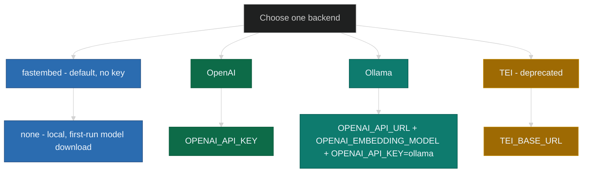
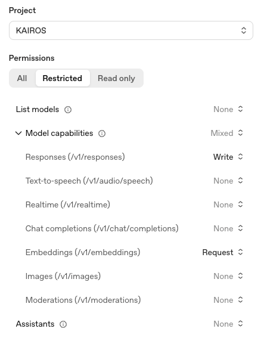

# Installation prerequisites

Use this page before you set `.env` or configure your MCP host. First confirm
the local requirements, then choose the embedding backend that determines
which variables you place in `mcp.json` `env` (stdio) or in the process
environment (HTTP server).

SquadRules ships as an **npm-only** package; the paths below apply to the
`@squadrules/mcp` CLI and the `squadrules serve` process. Container-image and
Kubernetes deployment prerequisites live in their respective sibling repos
([containers](https://github.com/SquadRules/containers),
[charts](https://github.com/SquadRules/charts)).

---

## Prerequisites

| Requirement | Details |
|-------------|---------|
| **Node.js 24+** | Required. Node 24 is the supported LTS baseline; CI runs one advisory lane on Node Current (pin in `.github/workflows/`). |
| **`@squadrules/mcp` CLI** | Required. Primary interface for auth, bulk management, verification, and starting the server (`squadrules serve`). |
| **Python 3** | Optional. Only needed for repository helper scripts or advanced operator workflows. |

```sh
npm install -g @squadrules/mcp
squadrules --help
```

If any requirement is missing, fix it before you continue.

---

## Vector store

SquadRules keeps adapter and memory vectors in a store chosen by a single switch —
the presence of a non-empty `QDRANT_URL`:

- **Default: embedded LanceDB.** With no `QDRANT_URL` the server runs a local,
  file-backed LanceDB store, so the CLI / `serve` path needs no Qdrant, Redis, or
  Docker.
- **Qdrant is opt-in.** Set `QDRANT_URL` (and `QDRANT_API_KEY` when the server
  requires one) to select the Qdrant backend with unchanged collections. The
  development infrastructure in `compose/infra.yaml` starts a local Qdrant on
  `http://localhost:6333`.

There is no silent fallback between them, and an embedding provider is required in
both cases — the embedded store removes the database dependency, not the model. The
full selection rule and per-backend limitations are in
[Known issues & limitations § Vector store backends](../known-issues-and-limitations.md#vector-store-backends).

---

## Embedding backend

Choose the embedding backend before you populate `.env` or configure your
MCP host's `env` block. The application needs a text-embedding service to
convert text into vectors for the active store, and each backend uses a
different set of variables.

By default SquadRules embeds **locally** with
[fastembed](#local-fastembed-default) — no API key and no inference service — so
`npm install -g @squadrules/mcp && squadrules serve` runs with zero external
dependencies. Configure OpenAI or Ollama only when you want to override that
default; TEI is deprecated.

### Why an embedding model?

SquadRules stores adapter and workflow text as vectors in its store. An embedding
model produces those vectors from plain text so the server can search and train
by meaning instead of exact keyword matching.

Use a **text embedding** model exposed through an OpenAI-style
`POST /v1/embeddings` interface. Do not use a chat model for this purpose. Each
embedding model has a fixed output dimension, so changing models on an existing
collection can require a vector migration.

These examples use the local fastembed default, OpenAI
`text-embedding-3-small`, Ollama `nomic-embed-text`, or a self-hosted (deprecated)
TEI endpoint.

### Supported backends



---

### Local fastembed (default)

With no external provider configured, SquadRules embeds **locally** using
[fastembed](https://github.com/qdrant/fastembed) (`BAAI/bge-small-en-v1.5`, 384
dimensions). It needs **no API key and no inference service**, which is why
`npm install` followed by `squadrules serve` runs with zero external
dependencies.

```ini
# No configuration required for the default. Override only if needed:
# FASTEMBED_MODEL=fast-bge-small-en-v1.5
# FASTEMBED_CACHE_DIR=/custom/path   # default: <config dir>/models
```

- On first use fastembed downloads the model weights into a shared per-user
  cache directory (`$XDG_CONFIG_HOME/squadrules/models`, or
  `%APPDATA%\squadrules\models` on Windows) — the sibling of the embedded
  LanceDB data dir.
- The download is performed by fastembed's own downloader and **needs network
  access on first run**. Air-gapped installs must pre-seed that cache directory.
- The 384-d vectors differ in size from OpenAI `text-embedding-3-small` (1536)
  and TEI models, so switching providers on an existing collection can require a
  vector migration.
- Leave `EMBEDDING_PROVIDER=auto` (the default) and provide no external
  credentials to use it, or set `EMBEDDING_PROVIDER=fastembed` to pin it.

---

### OpenAI

Use OpenAI when you want a managed cloud embedding service.

- Your key must allow `POST /v1/embeddings`
- If you use a restricted key, enable **Embeddings** and disable unrelated
  capabilities where possible



**Environment variables (stdio host `env` or shell before `serve`):**

```ini
OPENAI_API_KEY=sk-...
# optional:
# OPENAI_EMBEDDING_MODEL=text-embedding-3-small
```

If you use a local repository checkout, validate the key with
`npm run dev:test-embedding-key`.

---

### Ollama

Use Ollama when you want a local embedding service with no external API key.

```sh
ollama pull nomic-embed-text
```

- `OPENAI_API_URL` must be the base URL only, without `/v1`
- `OPENAI_EMBEDDING_MODEL` is typically `nomic-embed-text`
- `OPENAI_API_KEY` must be `ollama`

| Server location | Ollama location | `OPENAI_API_URL` |
|-----------------|-----------------|------------------|
| `squadrules serve` on your laptop | Same machine | `http://127.0.0.1:11434` |
| HTTP server on a remote host | Same host | `http://127.0.0.1:11434` |
| HTTP server in a container | Host machine | Host IP or published port |

**Environment variables:**

```ini
OPENAI_API_URL=http://127.0.0.1:11434
OPENAI_EMBEDDING_MODEL=nomic-embed-text
OPENAI_API_KEY=ollama
```

Switching between OpenAI and Ollama can change vector size, which may require a
store migration.

---

### TEI

> **Deprecated (issue #11).** TEI remains functional but is soft-deprecated.
> Prefer the local fastembed default, OpenAI, or Ollama. A one-time startup
> warning is emitted when TEI is selected; removal is planned as a future
> breaking change.

Use TEI when you already operate a text-embedding inference service.

**Environment variables:**

```ini
TEI_BASE_URL=http://your-tei:8080
# TEI_MODEL=...
```

---

## Next steps

- **npm install path:** continue with
  [Install § Configure your MCP host](README.md#configure-your-mcp-host).
- **Container image path:** see
  [SquadRules/containers](https://github.com/SquadRules/containers).
- **Kubernetes (Helm) path:** see
  [SquadRules/charts](https://github.com/SquadRules/charts).
