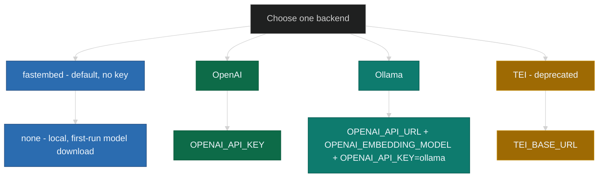

# Installation prerequisites

Use this page before you create `.env` or start the stack. First confirm the
local requirements. Then choose the embedding backend that determines which
variables you place in `.env` or Helm values.

---

## Prerequisites

### All installation paths

| Requirement | Details |
|-------------|---------|
| **Node.js 25+** + **[SquadRules CLI](../CLI.md)** | Required. Primary interface for auth, bulk management, and verification. Enables SquadRules usage without MCP. |

```sh
npm install -g @squadrules/mcp
squadrules --help
```

### Docker Compose path

| Requirement | Details |
|-------------|---------|
| **Docker Engine** + **Docker Compose v2** | Required for all Compose-based setups |
| Working directory with **`compose.yaml`** and writable **`.env`** | Required; a local `git clone` is optional |
| Source for **`compose.yaml`** | Use the file from the repository, a raw download, or another controlled copy |
| **Qdrant** | Started by Compose; no separate installation is required for the simple stack |
| **Identity provider** | Not part of the standard install path; manage it separately if your deployment needs one |
| **Node.js 24+** + **[SquadRules CLI](../CLI.md)** | Required; the CLI is the primary interface for install, authentication, and verification. Node 24 is the supported LTS baseline; CI runs one advisory lane on Node Current (pin in `.github/workflows/`) |
| **Python 3** | Required only for repository helper scripts or advanced operator workflows |

### Helm chart path (Kubernetes)

| Requirement | Details |
|-------------|---------|
| **Kubernetes** 1.28+ | Any conformant cluster |
| **Helm** v3.14+ | Package manager for Kubernetes |
| **kubectl** | Configured context targeting the cluster |
| **Operators** | Install per [Helm prerequisites](helm.md#operators) |
| **Gateway API CRDs** | Required when `gateway.enabled: true` |

If any requirement is missing, fix it before you continue.

---

## Vector store

SquadRules keeps adapter and memory vectors in a store chosen by a single switch —
the presence of a non-empty `QDRANT_URL`:

- **Default: embedded LanceDB.** With no `QDRANT_URL` the server runs a local,
  file-backed LanceDB store, so the CLI / `serve` path needs no Qdrant, Redis, or
  Docker.
- **Qdrant is opt-in.** The Docker Compose and Helm paths below start Qdrant and set
  `QDRANT_URL`, which selects the Qdrant backend with unchanged collections.

There is no silent fallback between them, and an embedding provider is required in
both cases — the embedded store removes the database dependency, not the model. The
full selection rule and per-backend limitations are in
[Known issues & limitations § Vector store backends](../known-issues-and-limitations.md#vector-store-backends).

---

## Embedding backend

Choose the embedding backend before you populate `.env` or configure Helm
values. The application needs a text-embedding service to convert text into
vectors for the active store, and each backend uses a different set of variables.

By default SquadRules embeds **locally** with
[fastembed](#local-fastembed-default) — no API key and no inference service — so
simple mode and `npx @squadrules/mcp serve` run with zero external dependencies.
Configure OpenAI or Ollama only when you want to override that default; TEI is
deprecated.

### Why an embedding model?

SquadRules stores adapter and workflow text as vectors in its store. An embedding
model produces those vectors from plain text so the server can search and train
by meaning instead of exact keyword matching.

Use a **text embedding** model exposed through an OpenAI-style
`POST /v1/embeddings` interface. Do not use a chat model for this purpose. Each
embedding model has a fixed output dimension, so changing models on an existing
collection can require a vector migration.

These examples use the local fastembed default, OpenAI
`text-embedding-3-small`, Ollama `nomic-embed-text`, or a self-hosted (deprecated)
TEI endpoint.

### Supported backends



---

### Local fastembed (default)

With no external provider configured, SquadRules embeds **locally** using
[fastembed](https://github.com/qdrant/fastembed) (`BAAI/bge-base-en-v1.5`, 768
dimensions). It needs **no API key and no inference service**, which is why
simple mode and `npx @squadrules/mcp serve` run with zero external dependencies.

```ini
# No configuration required for the default. Override only if needed:
# FASTEMBED_MODEL=fast-bge-base-en-v1.5
# FASTEMBED_CACHE_DIR=/custom/path   # default: <config dir>/models
```

- On first use fastembed downloads the model weights into a shared per-user
  cache directory (`$XDG_CONFIG_HOME/squadrules/models`, or
  `%APPDATA%\squadrules\models` on Windows) — the sibling of the embedded
  LanceDB data dir.
- The download is performed by fastembed's own downloader and **needs network
  access on first run**. Air-gapped installs must pre-seed that cache directory.
- The 768-d vectors differ in size from OpenAI `text-embedding-3-small` (1536)
  and TEI models, so switching providers on an existing collection can require a
  vector migration.
- Leave `EMBEDDING_PROVIDER=auto` (the default) and provide no external
  credentials to use it, or set `EMBEDDING_PROVIDER=fastembed` to pin it.

---

### OpenAI

Use OpenAI when you want a managed cloud embedding service.

- Your key must allow `POST /v1/embeddings`
- If you use a restricted key, enable **Embeddings** and disable unrelated
  capabilities where possible


**Docker Compose `.env`:**

```ini
OPENAI_API_KEY=sk-...
# optional:
# OPENAI_EMBEDDING_MODEL=text-embedding-3-small
```

**Helm values:**

```yaml
app:
  embedding:
    openai:
      existingSecret: squadrules-mcp-embedding
      secretKey: OPENAI_API_KEY
      model: text-embedding-3-small
```

If you use a local repository checkout, validate the key with
`npm run dev:test-embedding-key`.

---

### Ollama

Use Ollama when you want a local embedding service with no external API key.

```sh
ollama pull nomic-embed-text
```

- `OPENAI_API_URL` must be the base URL only, without `/v1`
- `OPENAI_EMBEDDING_MODEL` is typically `nomic-embed-text`
- `OPENAI_API_KEY` must be `ollama`

| App location | Ollama location | `OPENAI_API_URL` |
|--------------|-----------------|------------------|
| Compose on macOS or Windows | Host machine | `http://host.docker.internal:11434` |
| Compose on Linux | Host machine | Host IP or published port |
| `npm run dev:*` on the host | Same machine | `http://127.0.0.1:11434` |
| Helm (in-cluster Ollama) | Same namespace | `http://ollama:11434` |

**Docker Compose `.env`:**

```ini
OPENAI_API_URL=http://host.docker.internal:11434
OPENAI_EMBEDDING_MODEL=nomic-embed-text
OPENAI_API_KEY=ollama
```

**Helm values** (chart deploys Ollama StatefulSet):

```yaml
ollama:
  enabled: true
app:
  embedding:
    openai:
      model: nomic-embed-text
  extraEnv:
    - name: OPENAI_API_URL
      value: http://ollama:11434
    - name: OPENAI_API_KEY
      value: "ollama"
```

Switching between OpenAI and Ollama can change vector size, which may require a
Qdrant migration.

---

### TEI

> **Deprecated (issue #11).** TEI remains functional but is soft-deprecated.
> Prefer the local fastembed default, OpenAI, or Ollama. A one-time startup
> warning is emitted when TEI is selected; removal is planned as a future
> breaking change.

Use TEI when you already operate a text-embedding inference service.

**Docker Compose `.env`:**

```ini
TEI_BASE_URL=http://your-tei:8080
# TEI_MODEL=...
```

**Helm values:**

```yaml
app:
  extraEnv:
    - name: TEI_BASE_URL
      value: http://your-tei:8080
```

---

## Next steps

After you choose the backend, continue with your deployment path:

| Path | Next page |
|------|-----------|
| Docker Compose | [Simple stack §3](docker-compose-simple.md#3-environment-file) |
| Helm chart | [Helm installation](helm.md#3-create-a-values-file) |
